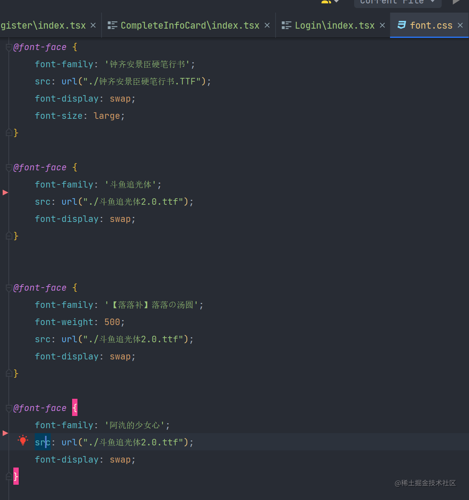

> `At-rules`规则是目前CSS中一种常见的语法规则，它使用一个`"@"`符号加一个关键词定义，后面跟上语法区块，如果没有则以分号结束即可。  
这种规则一般用于标识文档、引入外部样式、条件判断等等，本文是对该规则的使用总结。`

### @keyframes
> 使用 `@keyframes` 可以创建动画。在动画过程中，您可以更改CSS样式的设定多次。指定的变化时发生时使用％，或关键字“from”和“to”，等价于0％到100％  0％是开头动画，100％是当动画完成。

##### 示例
```
 @keyframes mycolor {
    0% { background-color: red; }
    30% { background-color: darkblue; }
    50% { background-color: yellow; }
    70% { background-color: darkblue; }
    100% { background-color: red; }
  }
```

##### css样式名称
- `animation-name`:动画的名称 用于指定一个@keyframes动画，指定要使用哪一个关键帧
- `animation-name`:动画持续时间 用于定义动画完成一个周期要多少秒或者多少毫秒
- animation-timing-function:动画的运动方式 指定动画将如何完成一个周期,有如下参数，通常不指定  默认ease
```
  ease;默认
  ease-in;  
  ease-out;
  ease-in-out;
  linear;
  steps(数值, 定位) 定位：start/end 默认end指逐步运动
```
- animation-delay:动画在组件渲染后多久开始
- animation-iteration-count:动画循环播放的次数，默认值为1，一般会设定为infinite（一直循环）
- animation-fill-mode：动画在播放完成后的状态，有两个值可以选择
```
  forwards 保持动画结束后的状态(通常选择这个，防止抖动)
  backwards 动画结束后回到最初的状态
```
- animation-direction:动画执行顺序----动画是否应该播放完后逆向交替循环（对设置了多次播放的动画有效），有三个值可供选择：

```
 normal 默认值（即执行完后回到起点再次执行）
 reverse 反向（即直接从终点反向执行到起点再反复）
 alternate 先从起点到终点，再从终点到起点
```

**以上所有css样式可以简写为:**
`animation: 动画执行时间 延迟时间 执行关键帧名称 运动方式 运动次数 结束状态 动画执行顺序`;
**更简形式为:**
``animation: 动画执行时间 执行关键帧名称;``

##### 简单应用
```css
div { 
	width: 200px;
	height: 200px;
	background: red;
}
@keyframes mycolor {
	0% { background-color: red; }
	30% { background-color: yellow; }
	60% { background-color: green; }
	100% { background-color: red; }
}
div:hover {
	animation-name: mycolor;
	animation-duration: 5s;
	animation-timing-function: linear;
	animation-iteration-count: 2;
}
```
##### 注意事项
`@keyframes的原理是把元素样式从一个状态慢慢的变为另外一个状态，所以是要能够进行渐变的样式才可以使用`
以下是不能生效的
```css
div {
    animation: appear 2s;
}
@keyframes appear {
    from { display:none; }
    to   { display:block;}
}
```
`常用于@keyframes的属性介绍`
- visibility和opacity
- color和background-color
- 盒子模型中的margin、pading、bottom、top、border

想到了再补充其他的

### @media
> 使用 @media，可以针对不同的媒体类型定义不同的样式。
> 使用 @media， 可以针对不同的屏幕尺寸设置不同的样式
> 当你重置浏览器大小的过程中，页面也会根据浏览器的宽度和高度重新渲染页面。

##### 简单示例子
```
@media mediatype and|not|only (media feature) {
    CSS-Code;
}
```
##### 媒体类型
-   all 【默认值】 匹配所有设备，无论是打印设备还是其他普通的现实设备。
-   screen 除打印设备和屏幕阅读设备以外的所有设备
-   speech 能够“读出”页面的屏幕阅读设备，通常供残疾人士使用
-   print 在打印和打印预览的时候生效

`此处一般情况下不写，采用默认值all，当前我们设计的前端项目一般不涉及speech、print、screen的区分`

##### 媒体特征（常用）
- 判断设备是横屏还是竖屏
```css
/* 横屏 */ 
@media (orientation: landscape) {} 
/* 竖屏 */ 
@media (orientation: portrait) {}

```
- 匹配设备的最大高度、最大宽度
```css
/* 如果高度小于600px */ 
@media (max-height: 600px) {}
/* 如果高度小于480px */ 
@media (max-height: 480px) {}

/*多重判断可以用or或者and*/
@media(min-height: 100px) and (max-height: 200px){
  body { background: #333; color: white; }
}

```
- 判断深色模式
```css

/* 深色模式 表示系统更倾向于深色模式*/
@media (prefers-color-scheme: dark) {
    body { background: #333; color: white; }
}
/* 浅色模式 表示系统更倾向于浅色模式*/
@media (prefers-color-scheme: light) {
    body { background: white; color: #333; }
}

```

##### 匹配规则

`从前往后，一旦匹配则终止`

### @import
> 用于导入其他样式文件

- 可以混用条件判断媒体查询
``` css
/* 宽度小于1000px才会生效 */
@import "./reset.css" screen and (max-width: 1000px); 

```

### @font-face
> @font-face 用于加载自定义字体。属于目前前端比较常用的语法，也有多开源的字体图标库可以使用既支持提供字体资源文件路径进行加载，也支持用户本地安装的字体加载

阿里开源字体库引用 示例
- 引入ttf文件


- font.css




- global.less中引入


