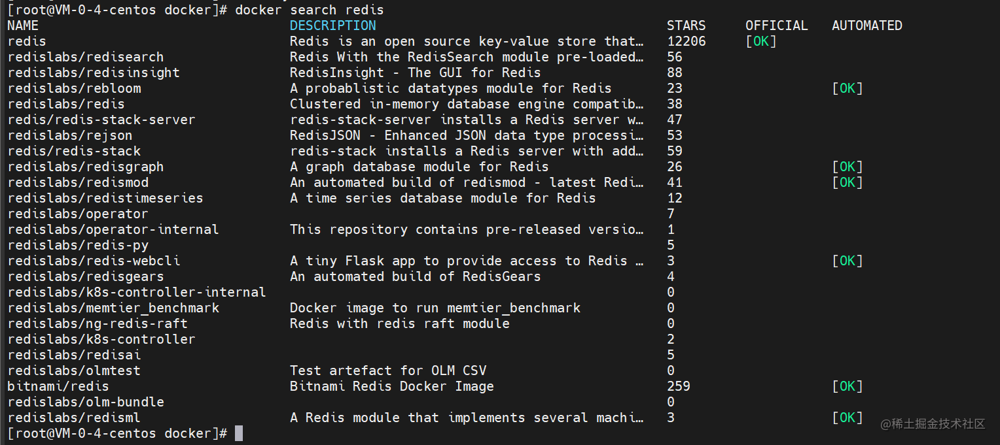
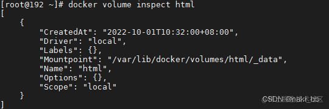
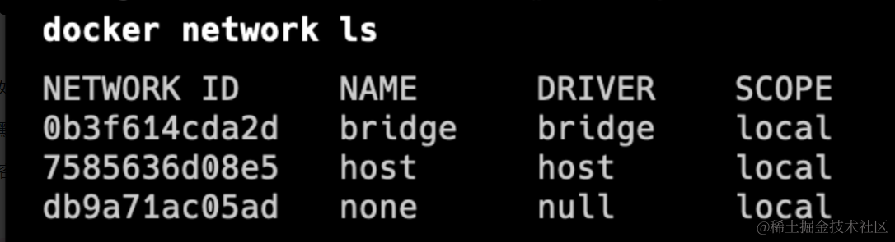

## 镜像相关
- 查看镜像列表
```bash
docker images
```
- 镜像搜索`显示包含name字段的所有官方镜像和star数，可以选择需要的进行下载`

```bash
docker search xnamex
```


- 下拉镜像
```bash
docker pull xnamex
docker pull xnamex:tag
```
- 删除镜像
``` bash
docker rmi -f xnamex/xidx
```
- 保存镜像（压缩为tar文件，可以随意取出）
``` bash
docker save xname/xidx -o 保存位置
```
- 加载镜像（配合前面的保存镜像）
``` bash
docker load -i 镜像tar包保存位置
```
### 容器相关

- 查看容器列表
``` bash
docker ps
```
- 创建容器

``` bash
docker run -it -d --name 运行的容器的别名 -p 宿主机端口：容器端口 -v 宿主机文件存储位置：容器内文件位置 镜像名：tag /bin/bash
```
`参数含义`:
1. -it 表示可以与该运行的容器进行交互，如进入mysql
2. -d 表示可以后台运行容器 （守护式运行）
3. /bin/bash 交互路径
4. -p 将容器的端口映射到宿主机上面，可以通过宿主机访问内部端口
5. -v 将容器内的指定文件夹挂载到宿主机对应位置（防止容器关闭后数据丢失）

- 停止容器

``` bash
docker stop xname/xidx
```
- 删除容器
``` bash
# 删除一个容器
docker rm -f xnamex/xidx
# 删除多个容器 空格隔开要删除的容器名或者容器id
docker rm -f xnamex/xidx xnamex/xidx xnamex/xidx
# 删除全部容器
docker rm -f $(docker ps -aq)
```
- 进入容器(只能进入正在运行的容器)

``` bash
docker attach xnamex/xidx
```
### 数据卷相关
- 创建数据卷
```bash
docker volume create xnamex
```
- 查看所有数据卷

``` bash
docker volume ls
```
- 查看数据卷的所有信息（包含关联的宿主机目录位置）
``` bash
docker volume inspect xnamex
```



- 删除数据卷

``` bash
docker volume rm xnamex
``` 
- 删除所有未使用过的数据卷

```bash
docker volume prune
```

### docker安装相关（linux）
1. 如果之前安装了旧版docker，请先删除。
```bash
sudo yum remove docker \
                  docker-client \
                  docker-client-latest \
                  docker-common \
                  docker-latest \
                  docker-latest-logrotate \
                  docker-logrotate \
                  docker-engine
```

2. 安装仓库
```bash
sudo yum install -y yum-utils

sudo yum-config-manager --add-repo https://download.docker.com/linux/centos/docker-ce.repo
```

3. 安装docker engine

```bash
sudo yum install docker-ce docker-ce-cli containerd.io docker-compose-plugin
```

4. 配置国内镜像仓库地址：

新建`/etc/docker/daemon.json`文件，输入如下内容：
```bash
{
  "registry-mirrors": [
    "https://registry.docker-cn.com",
    "http://hub-mirror.c.163.com",
    "https://fsp2sfpr.mirror.aliyuncs.com/"
  ]
}
```

5. 然后重启，配置开机启动

```bash
sudo systemctl restart docker
sudo systemctl enable docker
sudo systemctl enable containerd
```

### 网络相关
docker会自动创建三个网络，`bridge`,`host`,`none`





-   bridge桥接网络

如果不指定，新创建的容器默认将连接到bridge网络。

默认情况下，使用bridge网络，宿主机可以ping通容器ip，容器中也能ping通宿主机。

容器之间只能通过 IP 地址相互访问，由于容器的ip会随着启动顺序发生变化，因此不推荐使用ip访问。

-   host

`慎用，可能会有安全问题。`

容器与宿主机共享网络，不需要映射端口即可通过宿主机IP访问。（-p选项会被忽略）

主机模式网络可用于优化性能，在容器需要处理大量端口的情况下，它不需要网络地址转换 （NAT），并且不会为每个端口创建“用户空间代理”。

-   none

禁用容器中所用网络，在启动容器时使用。
