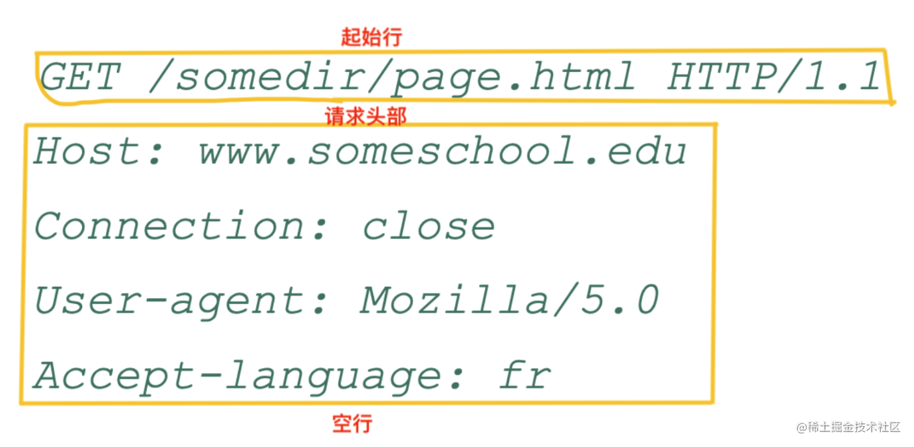
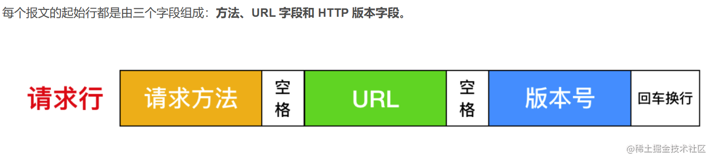
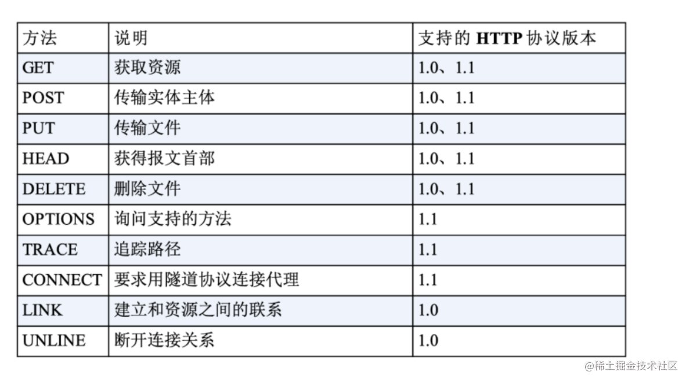
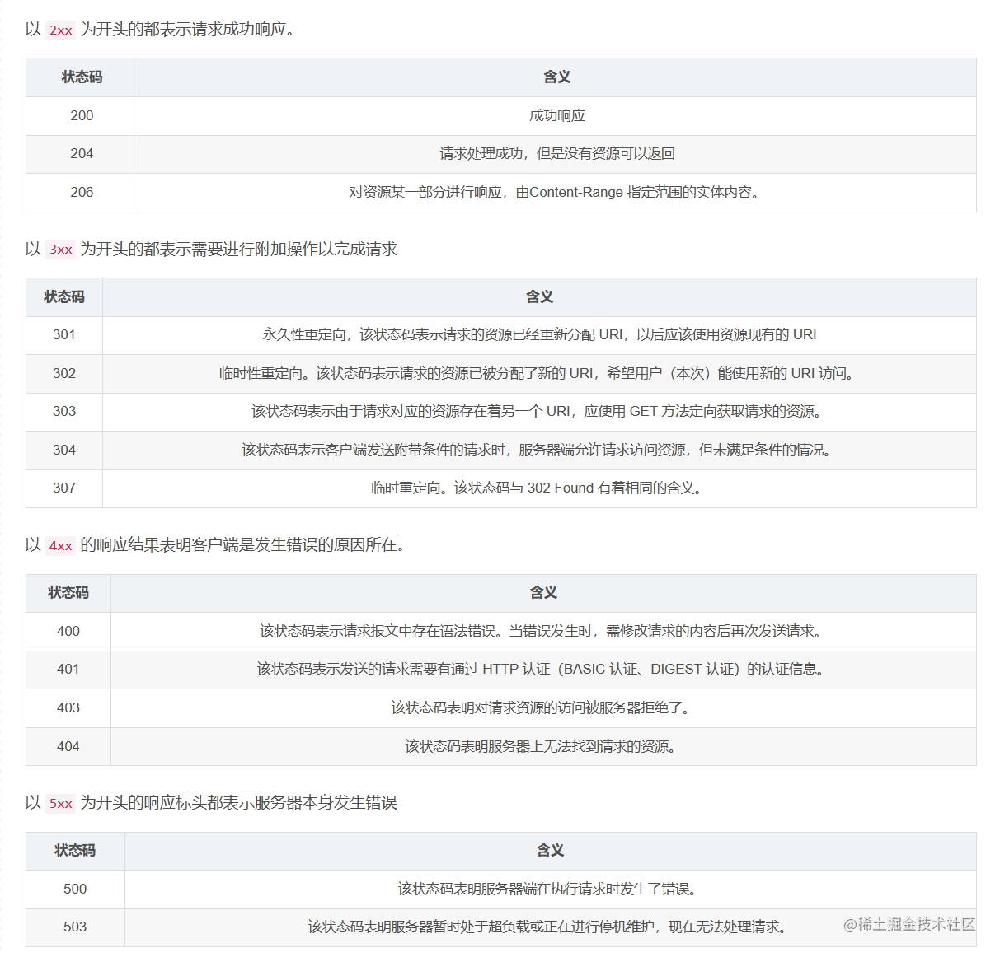

## http报文组成
-   `起始行（start line）`：描述请求或响应的基本信息；
-   `头部字段（header）`：使用 key-value 形式更详细地说明报文；
-   `消息正文（entity）`：实际传输的数据，它不一定是纯文本，可以是图片、视频等二进制数据。`此处在服务端代码编写的时候使用的是body属性`
     

## http请求方法
- GET 获取资源，GET 方法用来请求访问已被 URI 识别的资源。指定的资源经服务器端解析后返回响应内容。也就是说，如果请求的资源是文本，那就保持原样返回；

- POST 传输实体，虽然 GET 方法也可以传输主体信息，但是便于区分，我们一般不用 GET 传输实体信息，反而使用 POST 传输实体信息，

- PUT 传输文件，PUT 方法用来传输文件。就像 FTP 协议的文件上传一样，要求在请求报文的主体中包含文件内容，然后保存到请求 URI 指定的位置。

但是，鉴于 HTTP 的 PUT 方法自身不带验证机制，任何人都可以上传文件 , 存在安全性问题，因此一般的 W eb 网站不使用该方法。若配合 W eb 应用程序的验证机制，或架构设计采用REST（REpresentational State Transfer，表征状态转移）标准的同类 Web 网站，就可能会开放使用 PUT 方法。

- HEAD 获得响应首部，HEAD 方法和 GET 方法一样，只是不返回报文主体部分。用于确认 URI 的有效性及资源更新的日期时间等。`不常用`

- DELETE 删除文件，DELETE 方法用来删除文件，是与 PUT 相反的方法。DELETE 方法按请求 URI 删除指定的资源。

- OPTIONS 询问支持的方法，OPTIONS 方法用来查询针对请求 URI 指定的资源支持的方法。` 不常用`

- TRACE 追踪路径，TRACE 方法是让 Web 服务器端将之前的请求通信环回给客户端的方法。` 不常用`

- CONNECT 要求用隧道协议连接代理，CONNECT 方法要求在与代理服务器通信时建立隧道，实现用隧道协议进行 TCP 通信。主要使用 SSL（Secure Sockets Layer，安全套接层）和 TLS（Transport Layer Security，传输层安全）协议把通信内容加密后经网络隧道传输。
-

## http响应状态码

