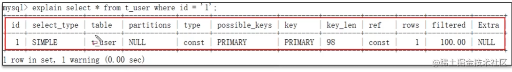
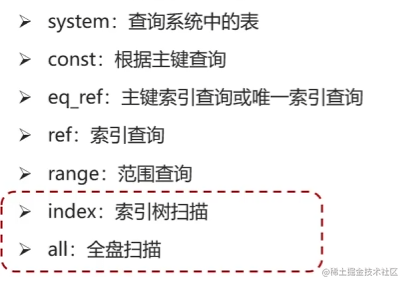
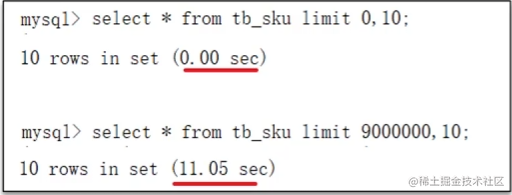
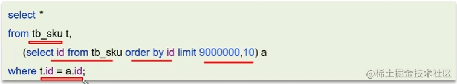
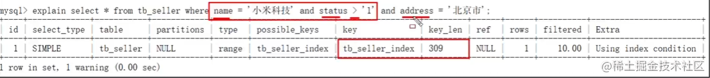
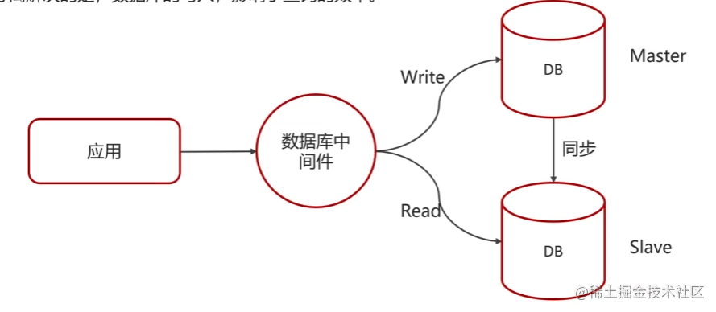
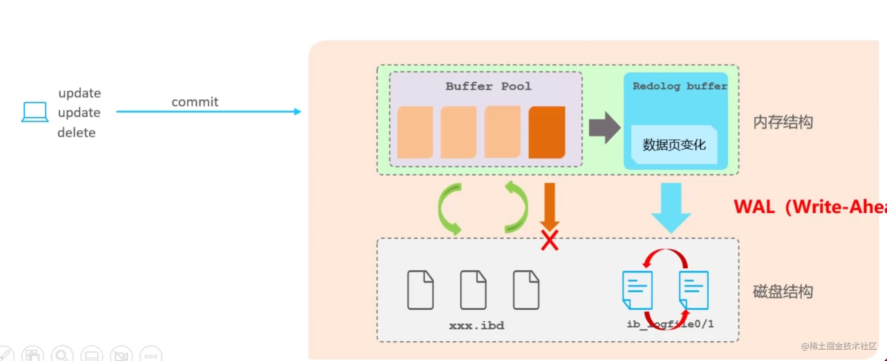
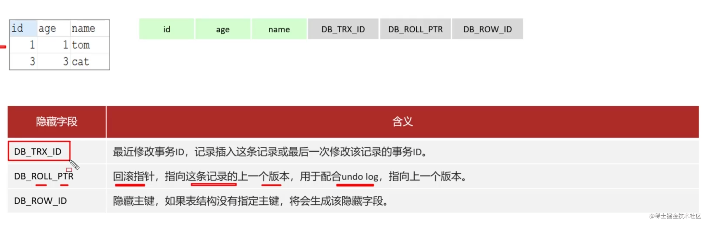
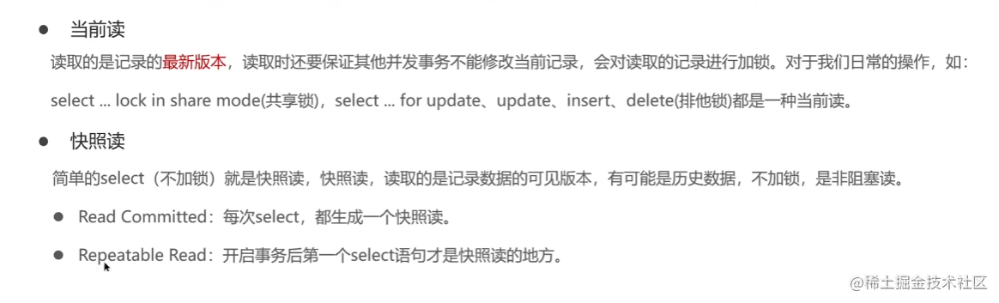
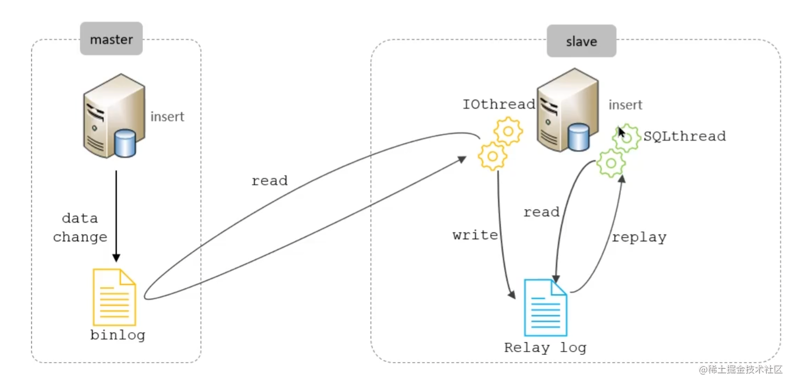

> 整理自各大面经及白马视频
# 优化
### 定位慢查询
##### 慢查询原因（多以压测时间1s以上）
1. 聚合查询
2. 多表查询
3. 表数据量过大查询
4. 深度分页查询

##### 检测工具
1. 调试工具：`Arthas`
2. 运维工具：`Prometheus`、`Skywalking`

##### mysql自带慢日志(`生产环境不建议开启，会有性能损耗`)
- 在mysql配置文件(`etc/my.cnf`)中配置如下信息

``` yml
# 开启mysql慢日志查询开关
slow_query_log=1
# 设置慢日志的时间为2s，sql语句执行时间超过两秒，则会被视为慢查询，记录查询日志
long_query_time=2
```
### 慢sql优化

##### select语句前使用`explain`或者`desc`获取mysql语句执行信息



- `possible_key` 当前sql可能会用到的索引
- `key` sql实际命中的索引
- `key_len` 索引所占大小
- `extra` 额外的优化建议


- `type` sql连接的类型（`index`或者`all`需要进行sql优化）



### 索引
##### 为什么选择b+树
1. 阶数更多，路径更短
2. 磁盘读写代价B+树更低，非叶子节点只存储指针，叶子节点存储数据
3. B+树便于扫库和区间查询，叶子节点是一个双向链表

##### b树与b+树的区别
1. 在B树中，非叶子节点和叶子节点都会存放数据，而B+树的所有的数据都会出现在叶子节点，在查询的时候，B+树查找效率更加稳定（每次查找都会到叶子节点）
2. 在进行范围查询的时候，B+树效率更高，因为B+树都在叶子节点存储，并且叶子节点是一个双向链表
3. 磁盘读写代价b+树更低（b树会将父节点数据也加载）

#####  什么是聚簇索引（主键或者唯一索引）和非聚簇索引（二级索引、非聚簇索引）


##### 回表查询
`回表的意思就是通过二级索引找到对应的主键值，然后再通过主键值找到聚集索引中所对应的整行数据，这个过程就是回表`

##### 覆盖索引
- 覆盖索引是指select查询语句使用了索引，在返回的列，必须在索引中全部能够找到，如果我们使用id查询，它会直接走聚集索引查询，一次索引扫描，`直接返回数据`，性能高。
- 如果按照二级索引查询数据的时候，返回的列中没有创建索引，有可能会触发`回表查询`，尽量避免使用select *，尽量在返回的列中都包含添加索引的字段

##### 超大分页怎么处理

- 场景



- 优化方案（`使用覆盖索引+子查询`）
  `先分页查询数据的id字段，确定了id之后，再用子查询来过滤，只查询这个id列表中的数据就可以了因为查询id的时候，走的覆盖索引，所以效率可以提升很多`


##### 索引创建原则
1. 数据量较大，查询频繁（10万条）
2. 正对常作为查询条件（where）、排序（order by）、分组（group by） 操作的字段建立索引
3. 尽量选择区分度高的列作为索引，尽量建立唯一索引，区分度越高，使用索引的效率就越高
4. 字符串类型的字段，且字段长度较长，可以针对字段特点，建立前缀索引
5. 尽量选用联合索引，减少单列索引，查询时候可以使用最左前缀法则覆盖索引，节省存储空间，避免回表，提高查询效率
6. 控制索引数量，影响增删改的效率（索引重构时间！）

##### 索引失效场景（使用explain检查）
1. 违反最左前缀法则
2. 对于`联合索引`,范围查询右边的列索引失效

`如下图，`status`使用了范围查询，导致address未使用索引`



3. 在索引列上使用运算操作导致失效
4. 模糊匹配%未在尾部导致失效

### sql优化方案
##### 表的设计优化
1.tinyint、int 、bigint根据实际情况选择
2.char定长效率高，varchar可变长度，效率较低
##### sql语句优化
1. select 语句尽量指定字段名称（避免*）
2. sql避免索引失效
3. union all 不会过滤重复数据，union会自动过滤重复数据（导致多一层过滤降低效率）
4. 避免在where中对字段进行表达式操作
5. 如果是表关联的话，尽量使用innerjoin ，不要使用left join、right join，如必须使用 一定要以小表为驱动
##### 主从复制、读写分离



# 事务
##### 事务特性
- 原子性（`Atomicity`）：事务是不可分割的最小单元，要么全部成功，要么全部失败
- 一致性（`Consistensy`）:事务完成时，必须使所有的数据都保持一致状态
- 隔离性（`Isolation`）：保证事务在不受外部并发操作影响的独立环境下运行
- 持久性（`Durability`）：事务一旦提交或者回滚，他对数据库中的数据的改变就是永久的

##### 并发问题
`此处还有`丢失修改`，指两个线程同时改，最后就是后面改的数据`


##### 事务隔离界别
`mysql8当前事务隔离级别repeatable-read已经可以解决幻读问题`


##### redolog和undolog
- `buffer pool`缓冲池：位于主存中，在执行增删改操作的时候，先操作缓冲池中的数据（缓冲池中没有则从磁盘加载进缓冲池），缓冲池的数据以一定频率刷新到磁盘，减少磁盘IO,加快处理速度
- `page`数据页：InnoDB存储引擎磁盘管理的最小单元，每个页的大小默认16kb，页中存储行数据


1.`redolog`分为`redo log buffer`(内存中)和`redo log file`（磁盘中），当`buffer pool`刷新数据到磁盘出错的时候，使用redolog进行数据恢复（`实现事务的持久性`）


2. `undolog`也称作回滚日志——记录了每条增删改语句的逆语句（`回滚`和`MVCC`）(`实现事务的原子性`)

###### MVCC
- 表记录中的隐藏字段（`DB_ROLL_ID`指向上一个版本id，`DB_TAX_ID`当前版本id）



- readview



- 数据库默认隔离级别RR情况下一直复用第一个readview，保证了每次查询数据一致

# 主从同步原理

1. 主库在事务提交时，会把数据变更记录在二进制日志文件 Binlog 中。
2. 从库读取主库的二进制日志文件 Binlog ，写入到从库的中继日志Relay Log 。
3. 从库重做中继日志中的事件，将改变反映它自己的数据




# 分库分表
- 水平分库：将一个库的数据分到多个库中，解决海量数据存储和高并发问题
- 水平分表：解决单表存储和性能问题（用的少）
- 垂直分库：微服务架构按业务分库
- 垂直分表：冷热数据分离，多表互不影响

# 三大范式
- 第⼀范式：每个列都不可以再拆分。
- 第⼆范式：在第⼀范式的基础上，⾮主键列完全依赖于主键，⽽不能是依赖于主键的⼀部分。
- `第三范式`：在第⼆范式的基础上，⾮主键列只依赖于主键，不依赖于其他⾮主键(`尽量遵守`)

# InnoDB和MyISAM的区别
- 锁粒度：InnoDB为行锁，MyISAM为表锁
- 可恢复性：InnoDB有事务日志，MyISAM不支持事务
- InnoDB是聚簇索引，叶子节点存储着行数据，MyISAM是非聚簇索引，叶子节点存储的是行数据地址，需要再次寻址

