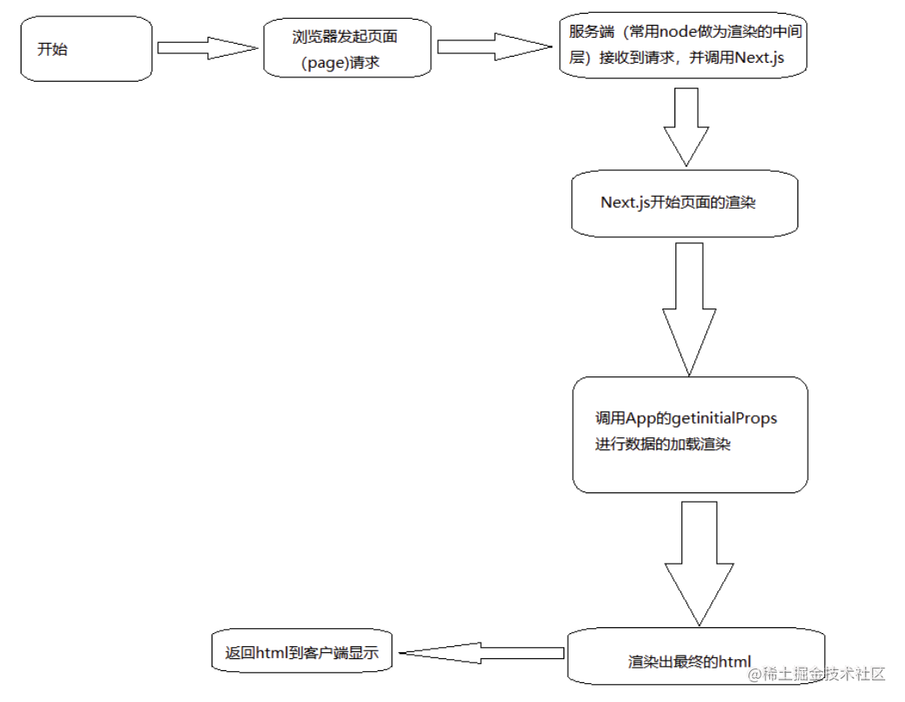
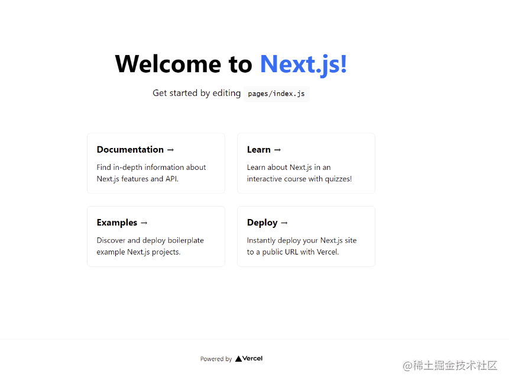

# nexj.js特点

#### 服务端渲染/客户端渲染/同构渲染的优缺点

- 首屏等待

在 SPA 模式下，所有的数据请求和 Dom 渲染都在浏览器端完成，所以当我们第一次访问页面的时候很可能会存在“白屏”等待，而服务端渲染所有数据请求和 html内容已在服务端处理完成，浏览器收到的是完整的 html 内容，可以更快的看到渲染内容，在服务端完成数据请求肯定是要比在浏览器端效率要高的多。

- SEO 优化

有些网站的流量来源主要还是靠搜索引擎，所以网站的 SEO 还是很重要的，而 SPA 模式对搜索引擎不够友好，要想彻底解决这个问题只能采用服务端直出。

##### 服务端渲染优点
- 前端渲染时间。因为后端拼接htm，浏览器只需直接渲染出来。
- 有利于SEO。服务端有完整的html页面，所以爬虫更容易获得信息，更利于seo
- 无需占用客户端资源，模板解析由后端完成，客户端只需解析标准的html页面，这样对客户端的资源占用更少，尤其是移动端，可以更加省电。
- 后端生成静态化文件。即生成缓存片段，这样就可以减少数据库查询浪费的时间了，且对于数据变化不大的页面非常高效 等。

##### 服务端渲染缺点
- 不利于前后端分离，开发效率很低
- 占用服务器端资源。请求过多对服务器压力很大。
- 即使局部页面发生变化也需要重新请求整个页面，费流量等。


#### next.js 项目搭建
- 先上图，next.js渲染流程



- 使用next.js官方脚手架快速生成next.js项目

> npm init next-app nextjs-blog --example "https://github.com/vercel/next-learn-starter/tree/master/learn-starter"

此时使用`yarn dev`就可以迅速启动项目啦




- next.js初探----页面跳转link

```typescript
import Link from 'next/link'

<Link href="/test">
   <span>test`1</span>
   <span>test`2</span>
 </Link>
```
- next.js初探----页面跳转router
```typescript
import Router from 'next/router'
<button onClick={()=>{Router.push('/test')}}>去test页面</button>
```

- next.js初探----接收页面跳转传入参数
```typescript

import { withRouter } from 'next/router'
import Link from 'next/link'

const  Test = ({router}) =>{
    return(
        <div>
            <p>{router.query.id}</p>
            <Link href={{pathname:'/'}}>
                <span>回首页</span>
            </Link>
        </div>
    )
}
export default withRouter(Test)

```

- next.js初探----路由钩子

```typescript
// 监听
Router.events.on('routeChangeStart', handleRouteChange)
// 关闭
Router.events.off('routeChangeStart', handleRouteChange)

 Router.events.on('routeChangeStart',(...args)=>{
   console.log('路由开始变化',...args)
})

Router.events.on('routeChangeComplete',(...args)=>{
  console.log('路由结束变化',...args)
})

Router.events.on('beforeHistoryChange,(...args)=>{
  console.log('浏览器 history改变之前',...args)
})

Router.events.on('routeChangeError,(...args)=>{
  console.log('跳转发生错误',...args)
})

Router.events.on('hashChangeStart,(...args)=>{
  console.log('hash模式路由改变刚开始',...args)
})

Router.events.on('hashChangeComplete,(...args)=>{
  console.log('hash模式路由改变结束',...args)
})
```

#### next.js核心---getServerSideProps（老师推荐）

在初始渲染时就拿到数据，需要在页面组件处导出名为getServerSideProps的async函数，如果不需要接口数据做seo，也可以在页面加载后使用ajax请求
```typescript
import { useRouter } from 'next/router'

export async function getServerSideProps(context) {
	// context为路由信息
	const query = context.query
	const id = query.id
	const res = await apirequestxxx(id)

  return {
  	// 信息可以在组件的props中拿到
    props: {
			detailData: res.data
		}
  }
}

const NoData = ({detailData}) => {
  return (
    <div>
      // ...
    </div>
  )
}

```

> 聊胜于无，感觉前后端分离开发才是大势所趋


