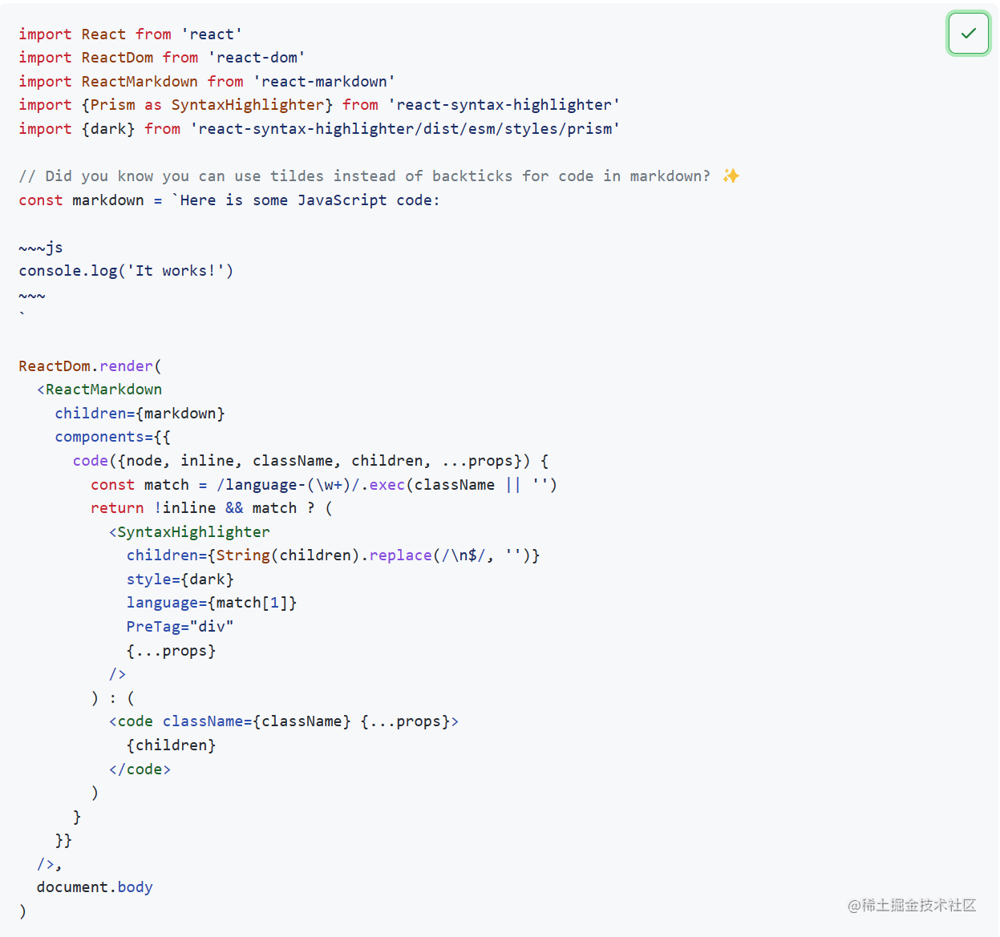
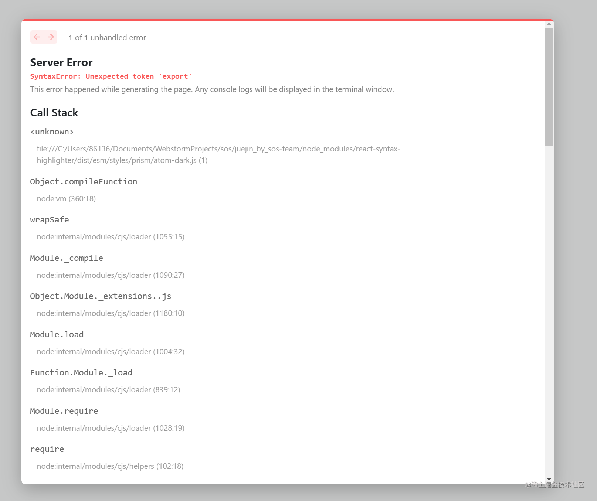

### 前往react-markdown的github官网参照使用

首先安装react-markdown插件
```bash
yarn add react-markdown
```

- 看了几份使用样例，最终找到了封装最完善的react-markdown使用实例




- 但是按照此样例搬运上nextjs后却发现报错




- 经过一番操作后发现无解，只能把`react-syntax-highlighter/dist/esm/styles/prism`删除，然后去掉style样式，代码如下

```typescript
// index.jsx

import React from 'react'
import ReactMarkdown from 'react-markdown'
import remarkGfm from 'remark-gfm'// 划线、表、任务列表和直接url等的语法扩展
import rehypeRaw from 'rehype-raw'// 解析标签，支持html语法
import {Prism as SyntaxHighlighter} from 'react-syntax-highlighter'
import styles from './MarkdownDisplay.module.less'
import dark from 'react-syntax-highlighter/dist/esm/styles/prism/atom-dark'

interface IProps {

    content: string
}

const MarkdownDisplay: React.FC<IProps> = (props) => {
    const {content} = props

    return (
        <ReactMarkdown
            className={styles.markdownDisplay}
            children={content}

            remarkPlugins={[remarkGfm]}
            rehypePlugins={[rehypeRaw]}
            components={{
                code({inline, className, children, ...props}) {
                    const match = /language-(\w+)/.exec(className || '')
                    return !inline && match
                        ? (
                            <SyntaxHighlighter
                                children={String(children).replace(/\n$/, '')}
                                style={dark}
                                language={match[1]}
                                PreTag="div"
                            />
                        )
                        : (
                            <code className={className} {...props}>
                                {children}
                            </code>
                        )
                },
            }}
        />

    )
}
export default MarkdownDisplay

// css部分 采用继承父类的min-width、max-width使得图片撑满布局

.markdownDisplay{
  background-color: white;
  p{
    img{
      min-width: inherit;
      max-width: inherit;
    }
  }
}


```

- 此时页面可以正常显示，无任何报错，但是在`git commit`到本地仓库的时候会出现`ESlint检查`错误

```bash
117:17  Warning: Using `` could result in slower LCP and higher bandwidth. Use `<Image />` from `next/image` instead to utilize Image Optimization. See: https://nextjs.org/docs/messages/no-img-element  @next/next/no-img-element
./components/MarkdownDisplay/index.tsx
Error: Unexpected unlimited 'eslint-disable-line' comment. Specify some rule names to disable.  eslint-comments/no-unlimited-disable
26:32  Error: Unexpected mix of '&&' and '?:'. Use parentheses to clarify the intended order of operations.  no-mixed-operators
27:19  Error: Unexpected mix of '&&' and '?:'. Use parentheses to clarify the intended order of operations.  no-mixed-operators
Error: Unexpected unlimited 'eslint-disable-line' comment. Specify some rule names to disable.  eslint-comments/no-unlimited-disable
info  - Need to disable some ESLint rules? Learn more here: https://nextjs.org/docs/basic-features/eslint#disabling-rules
husky - pre-commit hook exited with code 1 (error)

```

`如果有大佬解决还请留言`

### 前往react-markdown的github官网参照使用

首先安装react-markdown插件
```bash
yarn add markdown-navbar # or `npm i markdown-navbar --save`
```

- 有一说一，这个插件真的好用,自动实现了`markdown标题跳转和标题高亮`，减少了手动dom元素的操作，而且性能佳佳~

代码如下

```typescript
//index.tsx


import MarkNav from 'markdown-navbar'
import React from 'react'
import styles from './MarkdownNav.module.less'
import 'markdown-navbar/dist/navbar.css'

interface IProps {
  content: string
}

const MarkdownNav: React.FC<IProps> = (props) => {
  const { content } = props
  return (
        <div className="nav-menu">
            <MarkNav
                className={styles.markdownNav}
                source={content}
                headingTopOffset={10}
                ordered={false}// 是否显示标题题号1,2等
            />
        </div>
  )
}

export default MarkdownNav

```

如果你想让它变的更好看一点可以手动再加一些css样式（通过f12得知他的每个标题均为div元素）
```less
//css

.markdownNav {
  padding: 0 0 0 11px;
  overflow-x: hidden;
  overflow-y: auto;


  div {
    display: inline-block;
    color: inherit;
    padding: 8px;
    width: 80%;
    white-space: nowrap;
    overflow: hidden;
    text-overflow: ellipsis;
    line-height: 18px;
    cursor: pointer;
    border-radius: 10px;

    &:hover {
      color: #1171ee;
      background-color: #e7e7e7;
      transition: 0.2s;
    }

   /* &:active {
      position: relative;
      &:before {
        content: "";
        position: absolute;
        top: 4px;
        left: 0;
        margin-top: 7px;
        width: 4px;
        height: 16px;
        background: #1e80ff;
        border-radius: 0 4px 4px 0;
      }
    }*/

  }
}

.active{
  color: pink;
  &:before {
    content: "";
    position: absolute;
    top: 4px;
    left: 0;
    margin-top: 7px;
    width: 4px;
    height: 16px;
    background: #1e80ff;
    border-radius: 0 4px 4px 0;
  }
}

```

