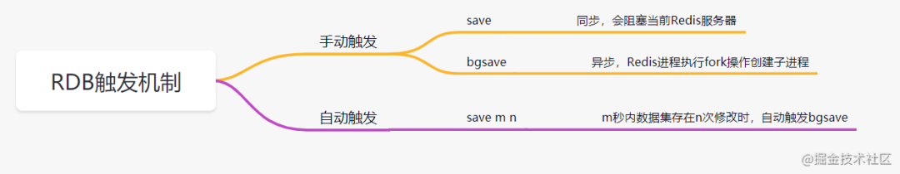
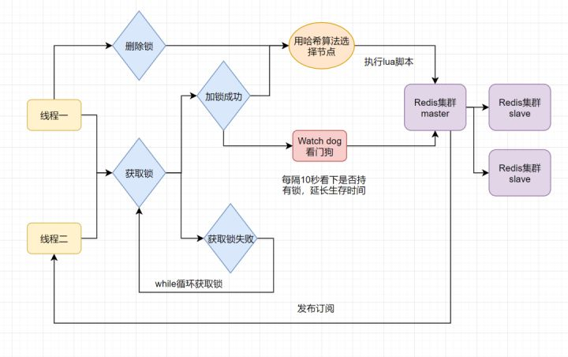

### RDB和AOF

#### RDB触发机制



#### RDB 的优点

- 适合大规模的数据恢复场景，如备份，全量复制等

#### RDB缺点

- 没办法做到实时持久化/秒级持久化。
- 新老版本存在RDB格式兼容问题
- 如果是save指令，会阻塞，因为是主线程执行的。
- 如果是bgsave指令，是fork一个子进程来写入RDB文件的，快照持久化完全交给子进程来处理，父进程则可以继续处理客户端的请求。

#### AOF的优点

- 数据的一致性和完整性更高

#### AOF的缺点

- AOF记录的内容越多，文件越大，数据恢复变慢。

### redis分布式锁的最终方案

- set ex px nx + 校验唯一随机值,再删除
  `此处使用lua脚本，保证原子性`

```lua
if redis.call('get',KEYS[1]) == ARGV[1] then return redis.call('del',KEYS[1]) else return 0 end;
```

弊端： 存在锁过期释放了，业务还没执行完的问题

- 加入Redisson看门狗机制解决锁过期释放，业务没执行完的问题

> 开启一个定时守护线程，每隔一段时间检查锁是否还存在，存在则对锁的过期时间延长，防止锁过期提前释放。
`工作流程：`


### MySQL与Redis 如何保证双写一致性

- 缓存延时双删
- 删除缓存重试机制（用消息队列确保延时的第二次删除成功，即失败了就继续删）
- 读取binlog异步删除缓存（mysql的binlog放消息队列）

