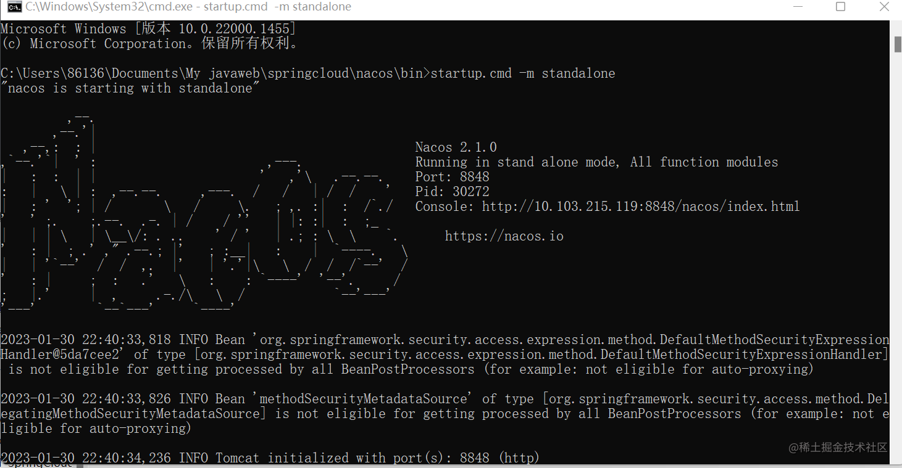
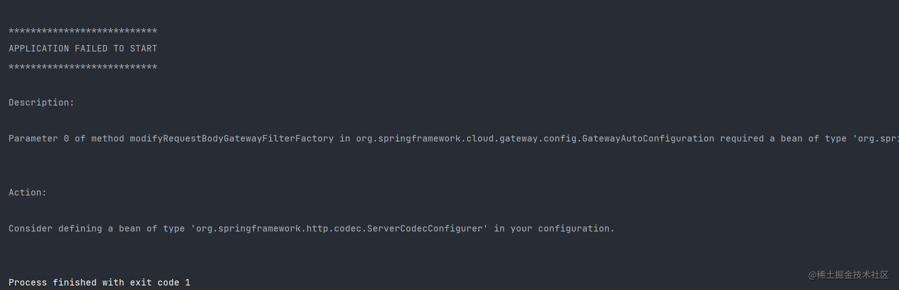
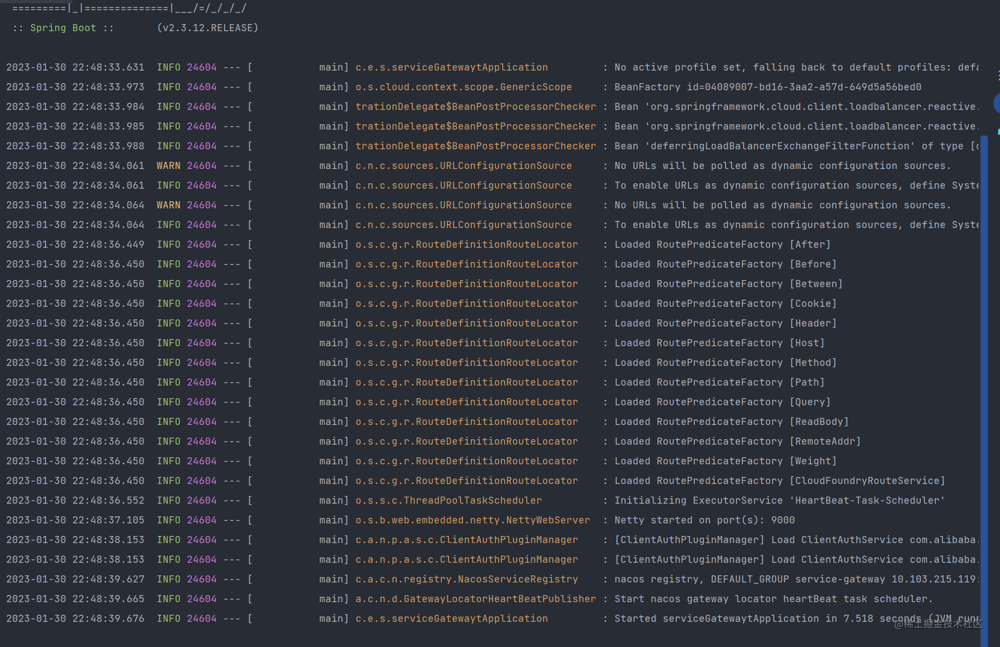
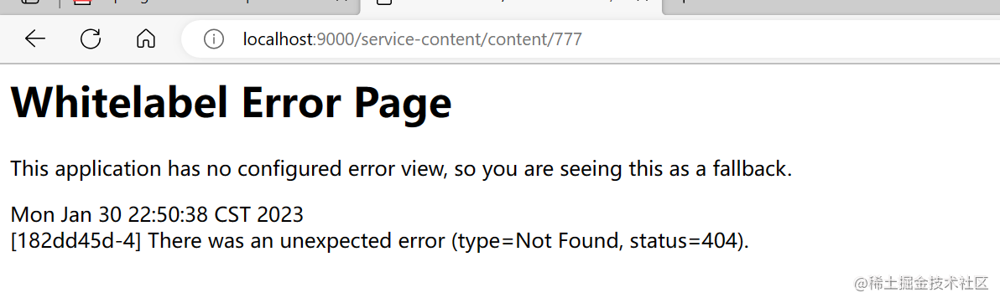
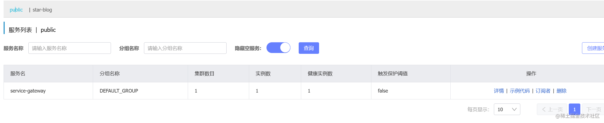
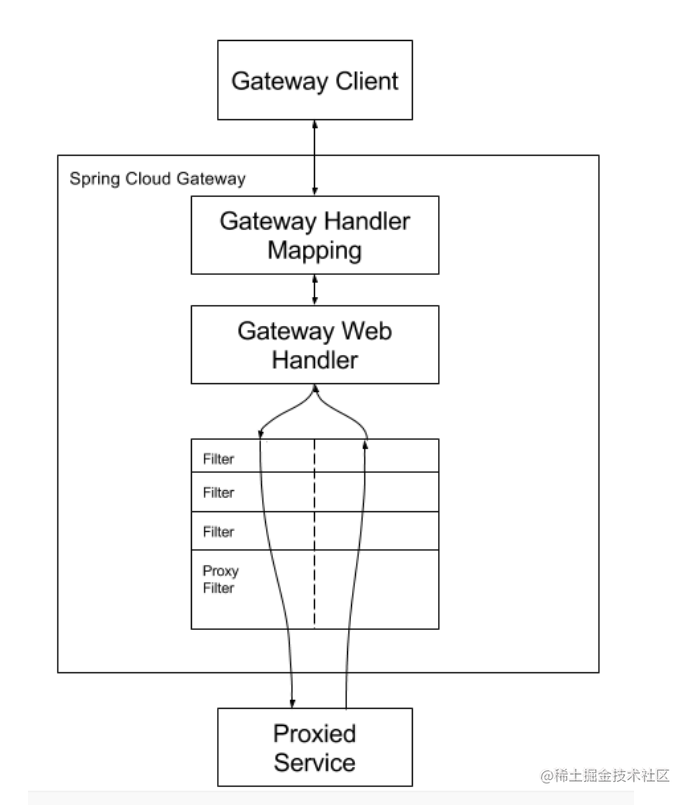

### 在springcloud alibaba中集成gateway
##### 新建maven项目service-gateway并在pom文件中导入springcloud gateway依赖
```XML
      <!--gateway⽹关-->
        <dependency>
            <groupId>org.springframework.cloud</groupId>
            <artifactId>spring-cloud-starter-gateway</artifactId>
        </dependency>
```
##### 加入nacos服务发现依赖和nacos服务注册中心适配
```xml
  <dependency>
            <groupId>com.alibaba.cloud</groupId>
            <artifactId>spring-cloud-starter-alibaba-nacos-discovery</artifactId>
        </dependency>

```
#### 在bootstrap.yml配置文件中进行相关配置
```yaml
server:
  port: 9000
spring:
  application:
    name: service-gateway
  cloud:
    gateway:
      discovery:
        locator:
          #让gateway可以发现nacos中的微服务
          enabled: true
    nacos:
      discovery:
        server-addr: localhost:8848
```
`至此便完成了gateway路由的自动装配，通过访问9000端口完成请求的分发了`

#### 启动nacos




#### 书写测试接口controller
```JAVA
package com.example.servicecontent.controller;

import lombok.extern.slf4j.Slf4j;
import org.springframework.cloud.context.config.annotation.RefreshScope;
import org.springframework.web.bind.annotation.CrossOrigin;
import org.springframework.web.bind.annotation.GetMapping;
import org.springframework.web.bind.annotation.RequestMapping;
import org.springframework.web.bind.annotation.RestController;

/**
 * @author star
 * @date 2023/1/28 12:05
 */
@Slf4j
@RestController
@CrossOrigin
@RequestMapping("/content")
@RefreshScope
public class testController {

    @GetMapping("/777")
    public String post(){
        return "77777777777777777777777777777777777";
    }
}

```


#### 启动果然报错



`好在全网搜寻找到了解决方案`
原来是我继承了common工程，导致加入springweb依赖导致的报错，删除依赖，重新启动



#### 输入9000端口测试

`再次报错`


这下我发现了nacos的问题，springcloud gateway竟然在public分支里面，我的其他服务都在blog分支


`修改bootstrap.yml文件后再次启动 -------successful`


### springcloud gateway自定义配置详解

`如果想要自定义路由加载的话会用到以下参数`

- id，路由标识符，区别于其他 Route。
- uri，路由指向的⽬的地 uri，即客户端请求最终被转发到的微服务。
- order，⽤于多个 Route 之间的排序，数值越⼩排序越靠前，匹配优先级越⾼。
- predicate，断⾔的作⽤是进⾏条件判断，只有断⾔都返回真，才会真正的执⾏路由。
- filter，过滤器⽤于修改请求和响应信息。


### 全网爆火的gateway执行流程图



#### 其实还有一小部分gateway中的拦截器设置，俺觉得没啥必要不如去微服务中配就不过多阐述啦

