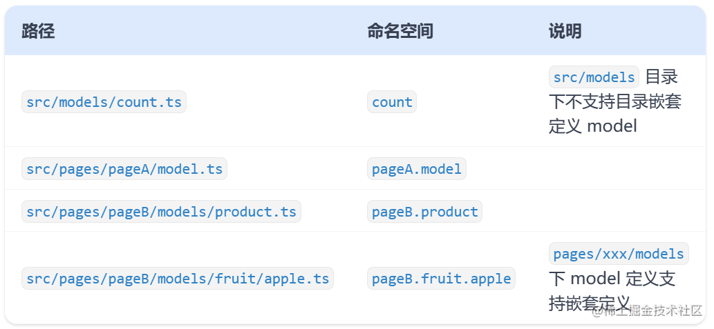
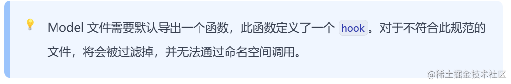

> 相信很多react初学者都有一段刻骨铭心的数据流学习经历，不用多说，从redux到mobx再到dva，真的很痛苦，全局数据流作为react开发中必不可少的一环，当然是越简单越好，所以，model诞生了，作为umi Max的内置全局数据流方案，他是我目前见过最简易的，相信也是公认最简易的

### umi max-------model简介

`@umi/max` 内置了**数据流管理**插件，它是一种基于 `hooks` 范式的轻量级数据管理方案，可以在 Umi 项目中管理全局的共享数据。

### model使用
1. 创建model
   数据流管理插件采用约定式目录结构，我们约定可以在 `src/models`, `src/pages/xxxx/models/`目录中，和 `src/pages/xxxx/model.{js,jsx,ts,tsx}` 文件引入 Model 文件。 Model 文件允许使用 `.(tsx|ts|jsx|js)` 四种后缀格式，**命名空间（namespace）**  生成规则如下。




`此处恰恰体现了model这种全局数据流方案最最最令人震惊的一点-------他就是自定义一个hooks，没有其他任何所谓的“黑魔法”`
```
// src/models/userModel.ts
export default () => {
const user = { username: 'umi', 
};

return { user };
};
```

`注意此处一定要写成函数式写法，不要形成dva惯性，写成下面这样（不要问我怎么知道的，我被折磨几天）`
```
export default {
    namespace: 'write',
```
umi官网也给了很足的提示



2.model的高级使用
- Model中是允许使用其他hooks的，这就意味着你直接把塔当成一个没有return的函数组件，随便写函数

官网告诉你可以这样用
```
// src/models/counterModel.ts
import { useState, useCallback } from 'react';

export default () => {
  const [counter, setCounter] = useState(0);

  const increment = useCallback(() => setCounter((c) => c + 1), []);
  const decrement = useCallback(() => setCounter((c) => c - 1), []);

  return { counter, increment, decrement };
};
```

我告诉你不仅可以定义hook，还可以这样用
```
export default () => {
  const [name, setName] = useState<string>(DEFAULT_NAME);

  const test=(value:string)=>{
   console.log(value)
  }
  return {
    name,
    setName,
    test
  };
};
```
`是不是感觉瞬间明朗起来`
3. 使用model
   `其实就一行简单代码，你函数return了什么，就可以用什么`
```
const { user, loading } = useModel('userModel');
```

4.一点性能优化
```
// src/components/CounterActions/index.tsx
import { useModel } from 'umi';

export default () => {
  const { add, minus } = useModel('counterModel', (model) => ({
    add: model.increment,
    minus: model.decrement,
  }));

  return (
      <div>
          <button onClick={add}>add by 1</button>
  <button onClick={minus}>minus by 1</button>
  </div>
);
};
```

