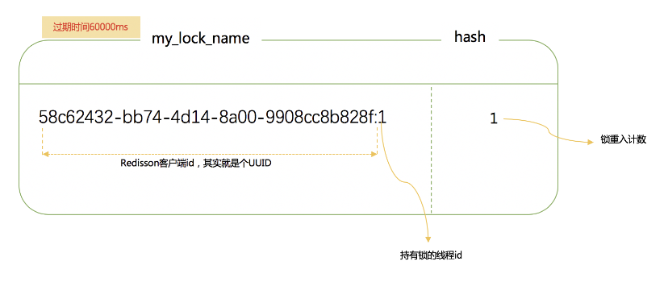
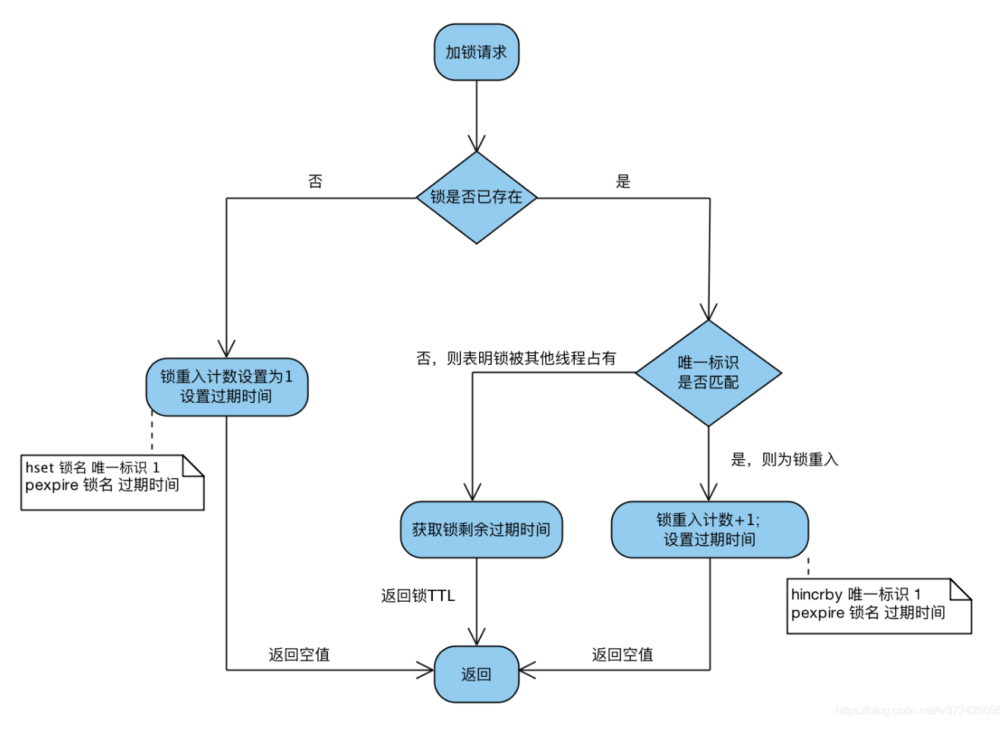
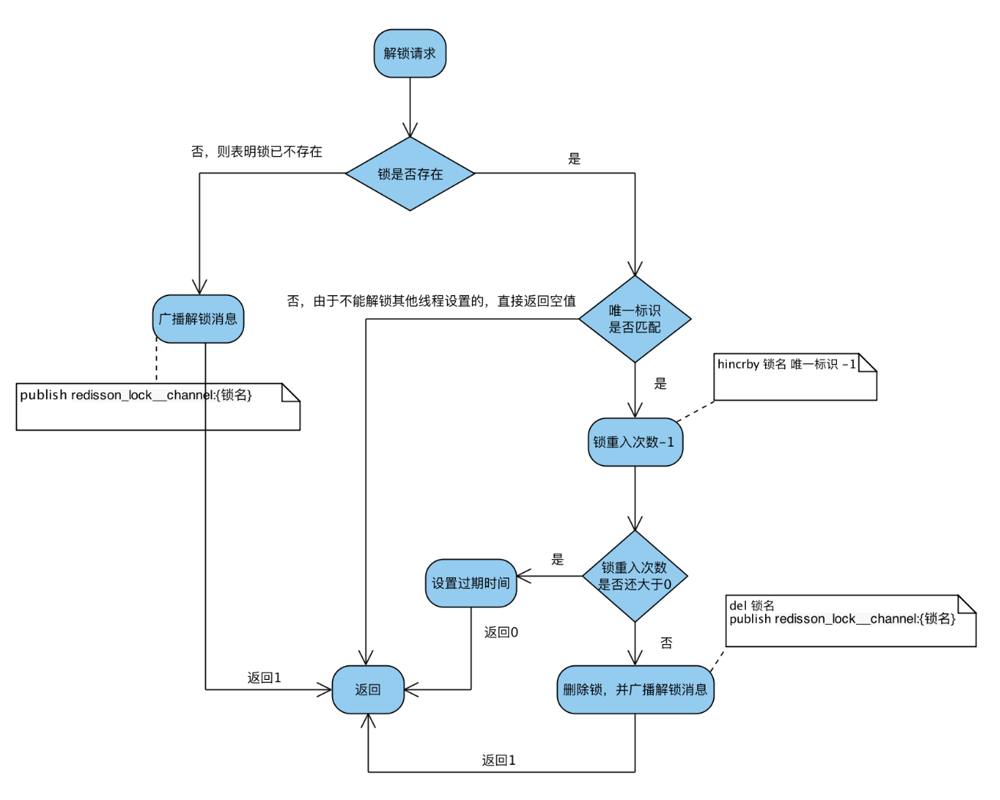

#### 字节青训营项目介绍

#### java线程池参数

> 参照以下代码

```java
import java.util.concurrent.*;
import java.util.concurrent.atomic.AtomicInteger;
 
/**
 * 线程池工厂工具
 *
 * @author 向振华
 * @date 2021/04/11 10:24
 */
public class ThreadPoolFactory {
 
    /**
     * 生成固定大小的线程池
     *
     * @param threadName 线程名称
     * @return 线程池
     */
    public static ExecutorService createFixedThreadPool(String threadName) {
        AtomicInteger threadNumber = new AtomicInteger(0);
        return new ThreadPoolExecutor(
                // 核心线程数
                desiredThreadNum(),
                // 最大线程数
                desiredThreadNum(),
                // 空闲线程存活时间
                60L,
                // 空闲线程存活时间单位
                TimeUnit.SECONDS,
                // 工作队列
                new ArrayBlockingQueue<>(1024),
                // 线程工厂
                new ThreadFactory() {
                    @Override
                    public Thread newThread(Runnable r) {
                        return new Thread(r, threadName + "-" + threadNumber.getAndIncrement());
                    }
                },
                // 拒绝策略
                new RejectedExecutionHandler() {
                    @Override
                    public void rejectedExecution(Runnable r, ThreadPoolExecutor executor) {
                        if (!executor.isShutdown()) {
                            try {
                                //尝试阻塞式加入任务队列
                                executor.getQueue().put(r);
                            } catch (Exception e) {
                                //保持线程的中断状态
                                Thread.currentThread().interrupt();
                            }
                        }
                    }
                });
    }
 
    /**
     * 理想的线程数，使用 2倍cpu核心数
     */
    public static int desiredThreadNum() {
        return Runtime.getRuntime().availableProcessors() * 2;
    }
}
```

#### 最大线程数8个，核心线程数4个，用LinkedBlockingQueue，前四个线程执行时间无限长，会怎么样

> 脑子抽了，答成会后面四个线程会在队列中阻塞等待

`正确理解应该为救急线程为4个（8-4），前四个线程执行时间无限长，后面四个线程会被救急线程执行`

#### 讲一讲对称加密和非对称加密

- 对称加密算法： DES（56长度密钥，分块加密）,AES（128长度或更长的密钥，分块加密）,3DES（进行3此DES）
- 非对称加密算法：RSA,DSA,ECDSA（基于椭圆密码学）,DIFFIE-HELLMAN（ssl和tls使用）

#### http和https的区别

#### redis分布式锁

- 为什么要设置过期时间
  1. 防止死锁，如果没有设置过期时间，如果业务执行时间过长，锁就会一直存在，其他线程就会一直等待，造成死锁
  2. `防止业务没有执行完，锁过期`，加锁之后会设置监听器（定时任务以小于过期时间的循环更新过期时间）`
  3. `当前机器如果宕机了，定时任务也就没了`，锁过期后释放，该请求也直接报错且数据回滚
- 为什么要在锁里面加上线程id
  1. 确保`可重入性`，让锁的值加一
  2. 防止其他线程就可以`随意释放锁`
> 锁长啥样



> 加锁流程



> 解锁流程





#### Linux 中查看进程占用的端口号

> netstat -tunlp | grep 端口号
（一脸问号。。。。。。。。。。。）

