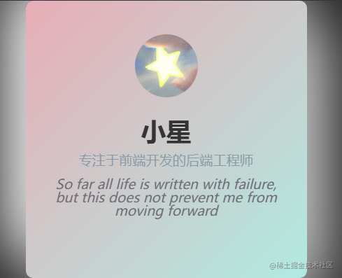
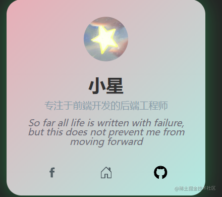
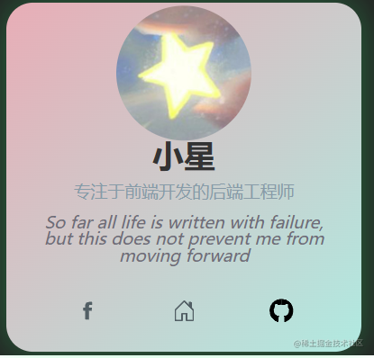
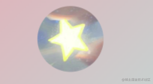
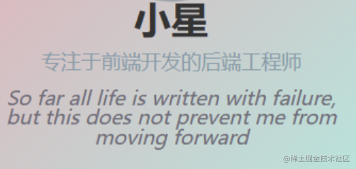
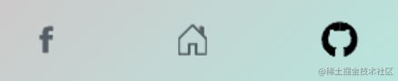
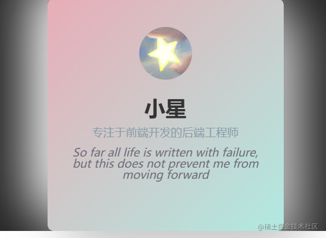
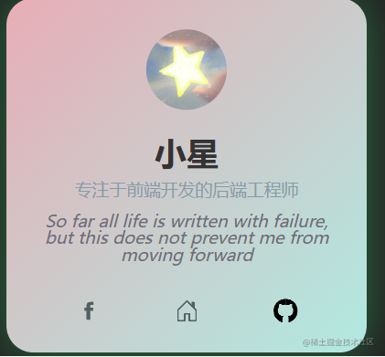

### 创作目的
- 进行前端开发这么久了，一直在做业务相关的需求，写组件样式的时候也是一种为了让组件不碍眼而写样式的心态，但是就我个人的看法，前端开发是和展示挂钩的，前端创作是能和用户产生共鸣的
-     如今的互联⽹⾏业⼀直流传着⼀句话：“⽤户⾄上”，想要提升⽤户体验，Web前端的作⽤⾮常重要
所以我选择了个人名片创作，我想写一份能和用户产生交互式体验，带给用户视觉冲击，表达用户个性的个人名片！

### 作品展示
-       由于掘金的md不让放视频，我截图做了展示









### 作品架构与设计
#### 我将整个个人名片主要分为了三部分-----头像部分、个人说明部分、底部链接部分、背景部分
- 头像



```less
//html
 <div class="card-avatar"></div>
 
//css
 .card-avatar {
 --size: 60px;
 width: var(--size);
 height: var(--size);
 border-radius: 50%;
 transition: transform .2s ease;
 margin-bottom: 1rem;
 background-image: url('https://staraway.love/QQ%E5%9B%BE%E7%89%8720230107162416.jpg');
 background-size: cover;
 background-repeat: no-repeat;
 background-position: center center;
}

.card-avatar:hover {
 transform: scale(1.7);
}

```
在这里主要通过
background-size: cover;
background-repeat: no-repeat;
background-position: center center;三个属性让图片呈现正常的展示效果

其次设置hover的时候图片放大1.7倍，至于tansition属性则是继承了父类，详情看最后的源码，也可以去作品处查看

- 个人说明部分




```html
//html
 <div class="card-title">小星</div>
      <div class="card-subtitle">专注于前端开发的后端工程师</div>
      <p class="text-body">So far all life is written with failure, but this does not prevent me from moving forward</p>
      
//css
.card-info {
 display: flex;
 flex-direction: column;
 justify-content: center;
 align-items: center;
 transition: transform .2s ease, opacity .2s ease;
}
.card-title {
 color: #333;
 font-size: 1.5em;
 font-weight: 600;
 line-height: 2rem;
}

.card-subtitle {
 color: #859ba8;
 font-size: 0.8em;
 margin-top: 5px;
}
.text-body {
  margin-top: 10px;
 font-size: .8em;
 text-align: center;
 color: #6f6d78;
 font-weight: 400;
 font-style: italic;
}
.card:hover .card-info {
 transform: translateY(-5%);
}
```
这里主要通过` flex-direction: column;`属性让所有元素呈纵向排布，同时在让不同元素的字体呈现不同的样式，设计中英文混合结构形成视觉差

- 底部链接部分



```html
.card-social {
 transform: translateY(200%);
 display: flex;
 justify-content: space-around;
 width: 100%;
 opacity: 0;
 transition: transform .2s ease, opacity .2s ease;


}

.card-social__item {
 list-style: none;
}

.card-social__item svg {
 display: block;
 height: 18px;
 width: 18px;
 fill: #515F65;
 cursor: pointer;
 transition: fill 0.2s ease ,transform 0.2s ease;
}

.card-social__item svg use{
   transform: scaleX(-1);
}

```
为了增加这里的交互式体验，我为三个图标均设立了hover样式，让其hover属性不生效时候不显示，并设立` transition: fill 0.2s ease ,transform 0.2s ease;`属性让其从下部弹出，在实际的开发中可以使用组件库所提供的affix标签为其提供鼠标hover时候展示说明的效果，

- 背景部分





```less
.card {
 width: 220px;
 height: 200px;
 padding: 2rem 1.5rem;
 transition: box-shadow .3s ease, transform .2s ease;
 text-align: center;
 position: relative;
 background: linear-gradient(135deg, #ebadb6 0%, #aceae1 100%);
 border-radius: 7px;
 box-shadow: 20px 20px 60px #bebebe, -20px -20px 60px #ffffff;
}
.card:hover {
 box-shadow: 0px 0px 30px 1px rgba(0, 255, 117, 0.30);
  transform: scale(0.98);
 border-radius: 20px;
 
}

```
此处主要通过背景虚化形成一种朦胧感，利用` box-shadow: 20px 20px 60px #bebebe, -20px -20px 60px #ffffff;`和`background: linear-gradient(135deg, #ebadb6 0%, #aceae1 100%);`属性形成色彩的错差感，当hover属性触发的时候在变清晰，形成良好的交互式体验

### 灵感源泉

- 其实我觉得程序员真的很需要美感，特别是开发岗，前端设计是一件很有成就感很幸福的事情，无所谓灵感，都是激励，正所谓我名片中所展示的
>  So far all life is written with failure, but this does not prevent me from moving forward