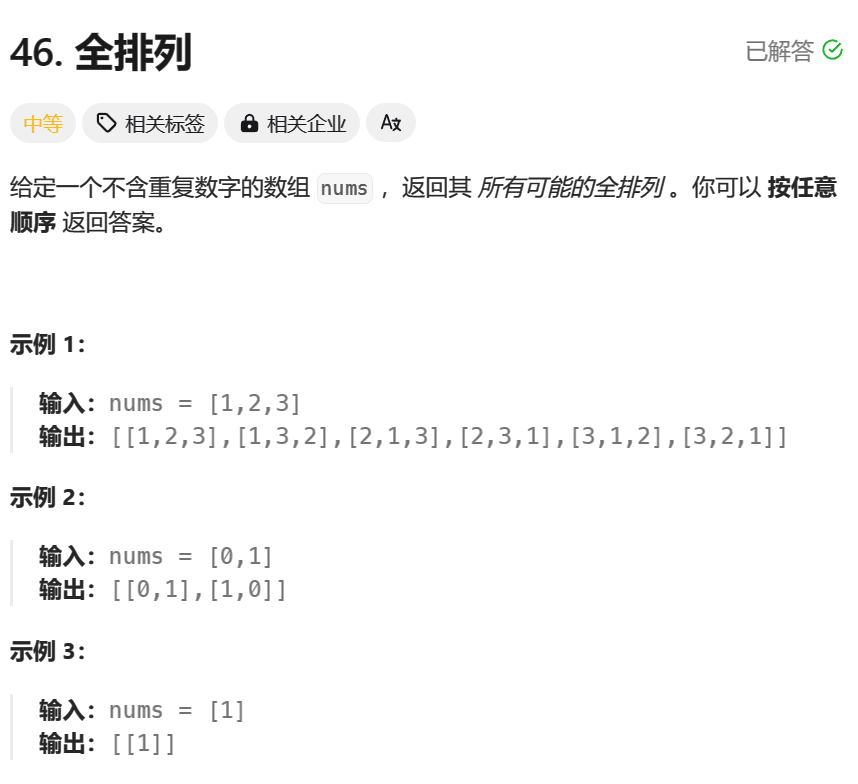
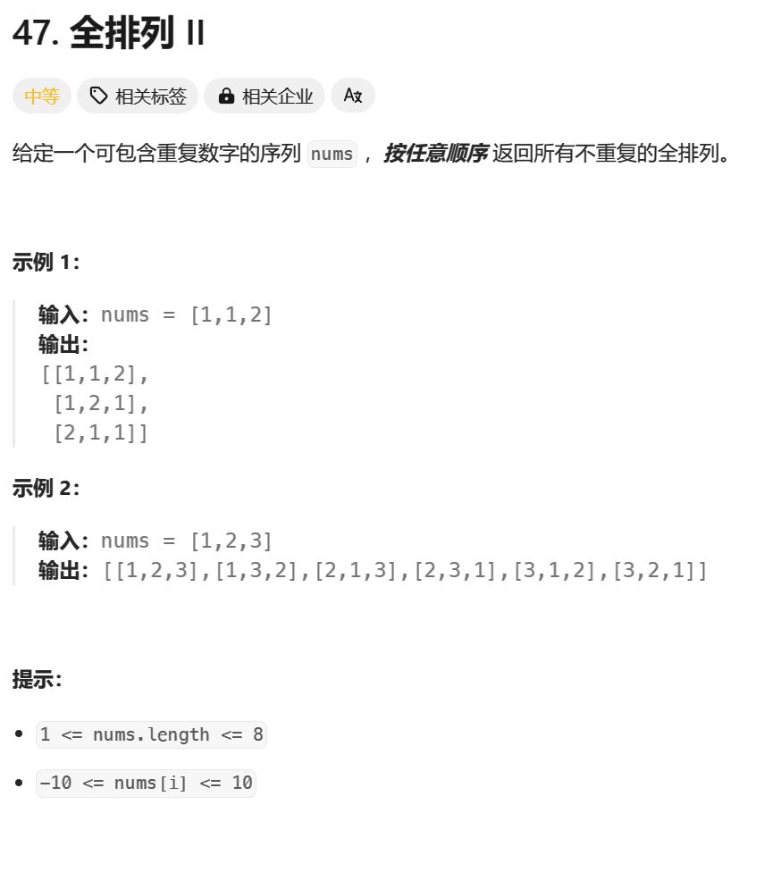
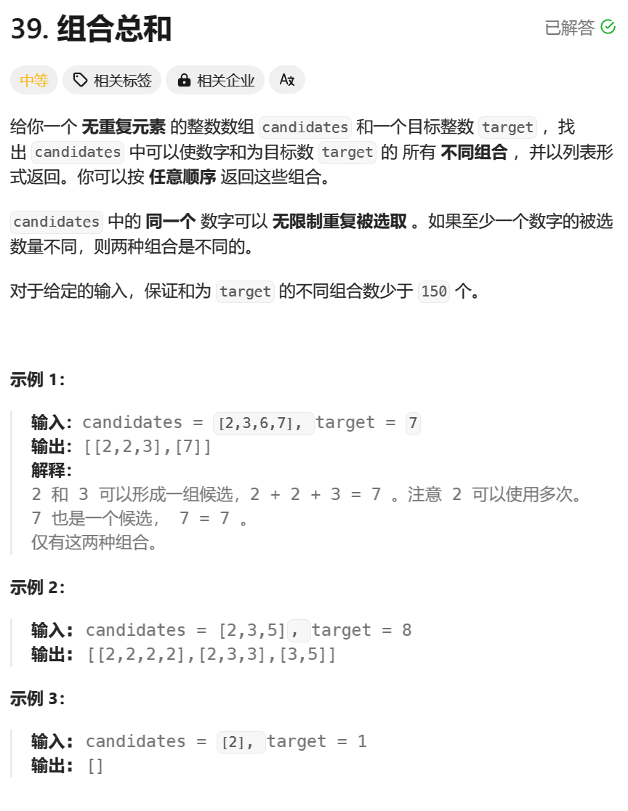
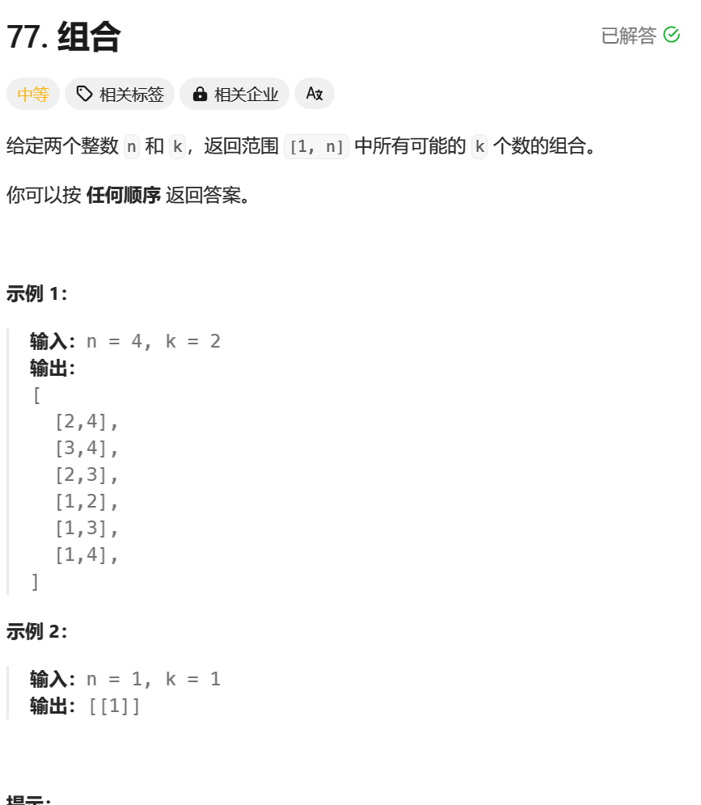
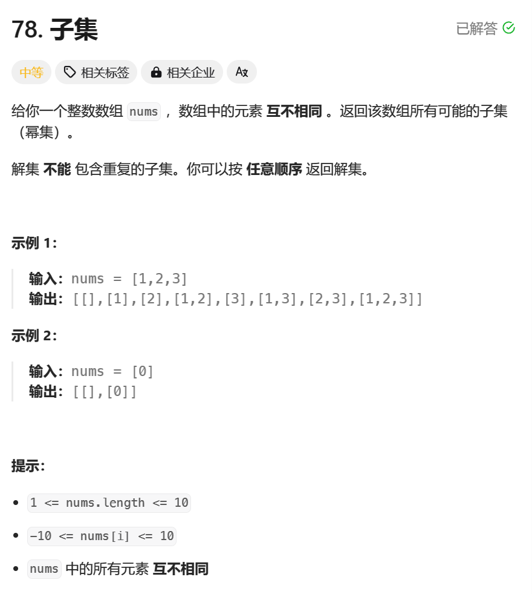
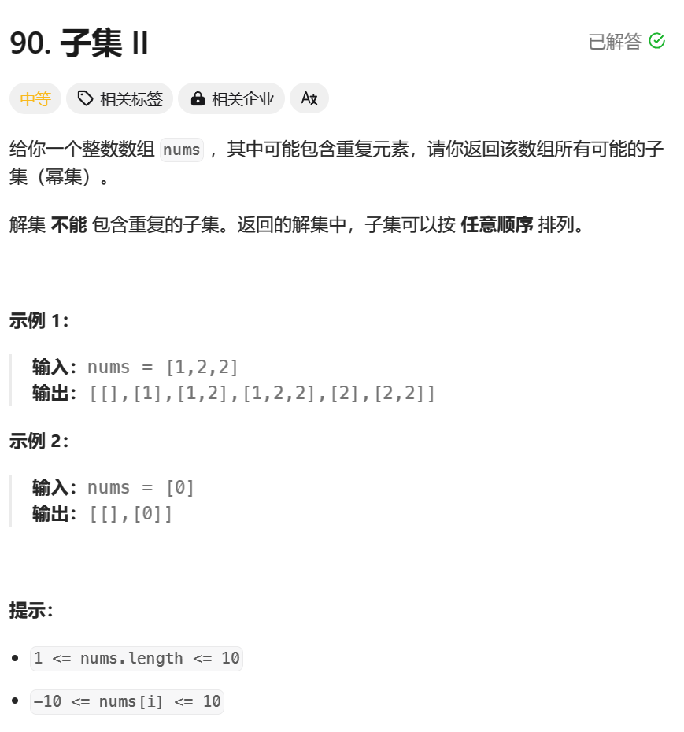
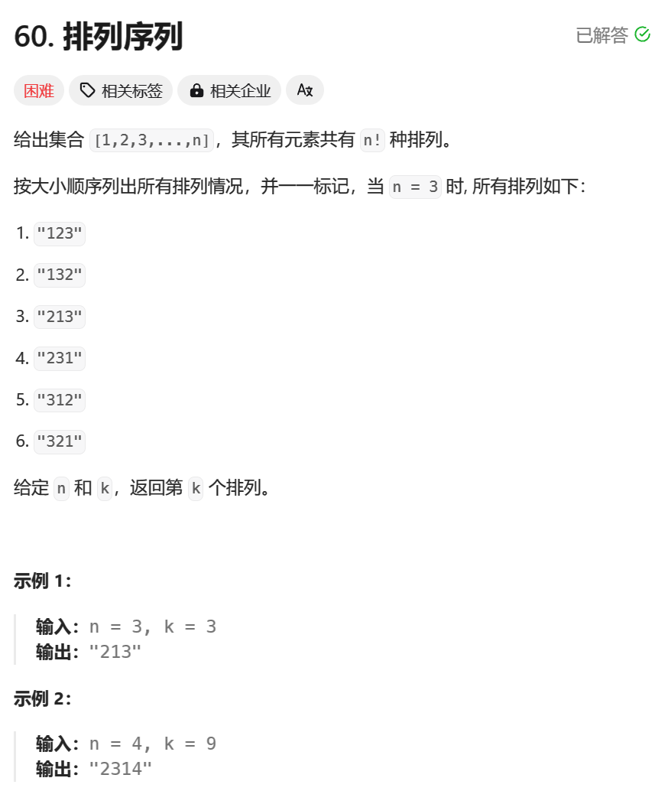
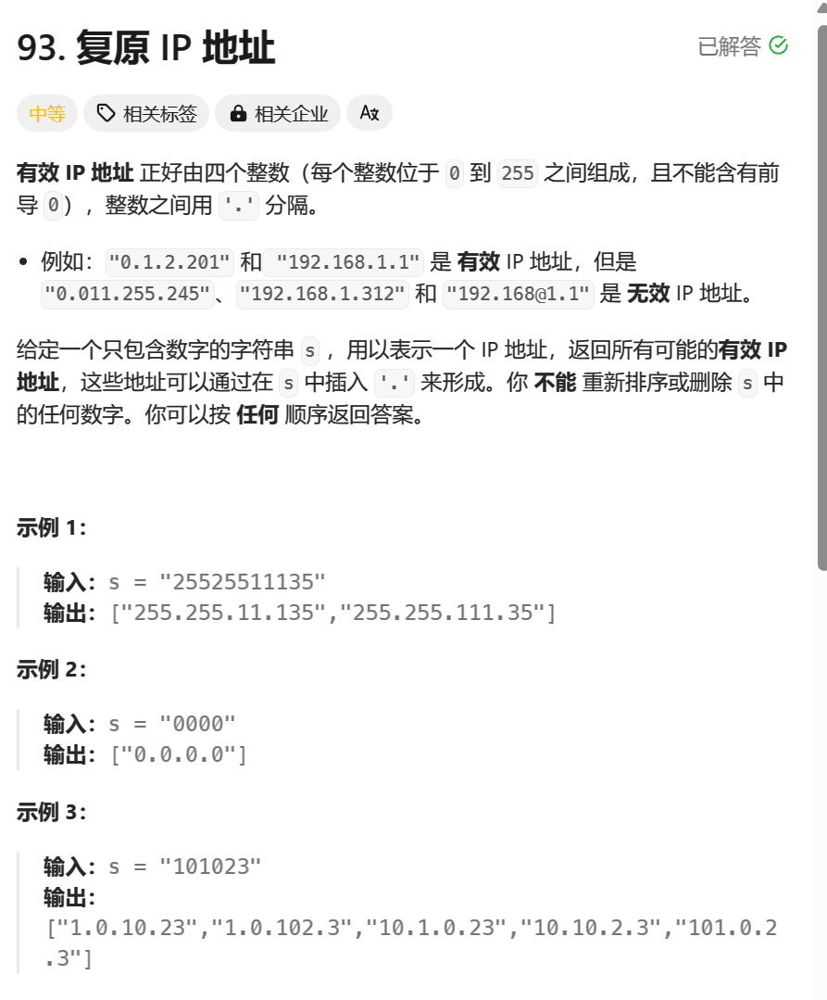

> 回溯算法初探————排列、组合、子集


## 整体解题步骤
该类型回溯算法有统一的代码解方案
1. 确定题解`res`格式和部分可能解`temp`格式

```java
// res
List<List<Integer>> res = new ArrayList<>();
// temp
Deque<Integer> path = new ArrayDeque<>(len);
```
2. 确定递归调用方法

```java
backTrack(nums, res, temp, 0, length, unused);
```
3. 指定递归终止条件

```java
        if (depth == len) {
            res.add(new ArrayList<>(path));
            return;
        }
```
4. 确定回溯位置

```
        for (int i = 0; i < len; i++) {
                path.addLast(nums[i]);
                dfs(nums, len, depth + 1, path, used, res);
                path.removeLast();
            }
        }
```

`往往还涉及到unused数组的使用或者begin变量，以防止重复情况`

####  [46. 全排列（中等）](https://leetcode-cn.com/problems/permutations/)

- 题目介绍


- 解题思路

`标准解题步骤基础上加上unused数组，避免元素重复`

`核心代码`：
```java
        if (depth == len) {
            res.add(new ArrayList<>(path));
            return;
        }

        for (int i = 0; i < len; i++) {
            if (!used[i]) {
                path.addLast(nums[i]);
                used[i] = true;

                dfs(nums, len, depth + 1, path, used, res);

                used[i] = false;
                path.removeLast();
            }
        }
```
- 完整代码

```java
class Solution {
    public List<List<Integer>> permute(int[] nums) {
        int len = nums.length;
        // 使用一个动态数组保存所有可能的全排列
        List<List<Integer>> res = new ArrayList<>();
        if (len == 0) {
            return res;
        }

        boolean[] used = new boolean[len];
        Deque<Integer> path = new ArrayDeque<>(len);

        // 调用深度优先搜索函数
        dfs(nums, len, 0, path, used, res);
        return res;
    }

    // 深度优先搜索函数
    private void dfs(int[] nums, int len, int depth,
                     Deque<Integer> path, boolean[] used,
                     List<List<Integer>> res) {
        // 如果达到了数组的长度，说明已经生成了一个全排列
        if (depth == len) {
            // 将当前路径中的元素添加到结果集中
            res.add(new ArrayList<>(path));
            return;
        }

        // 遍历数组中的每个元素
        for (int i = 0; i < len; i++) {
            if (!used[i]) {
                // 将当前元素加入路径中
                path.addLast(nums[i]);
                used[i] = true;

                // 递归调用深度优先搜索函数，继续生成下一个位置的元素
                dfs(nums, len, depth + 1, path, used, res);

                // 回溯操作，将当前元素从路径中移除，重新设置为未使用状态
                used[i] = false;
                path.removeLast();
            }
        }
    }
}
```

#### [47. 全排列 II（中等）](https://leetcode-cn.com/problems/permutations-ii/)
- 题目介绍




- 解题思路

`相较于全排列一，该题数字可以重复，考虑排序+从左到右第一次调用`

`核心代码：`
```java
// 排序
 Arrays.sort(nums);
 
//避免重复排列
     for (int i = 0; i < length; i++) {
            if (unused[i] || i > 0 && nums[i] == nums[i - 1] && !unused[i - 1]) {
                continue;
            }
            temp.addLast(nums[i]);
            unused[i] = true;
            backTrack(nums, res, temp, i, length, unused);
            unused[i] = false;
            temp.removeLast();
        }
```
- 完整代码

```java
class Solution {
    public List<List<Integer>> permuteUnique(int[] nums) {
        // 对数组进行排序，使相同的元素相邻，方便后续去重操作
        Arrays.sort(nums);
        // 用于保存结果的列表
        ArrayList<List<Integer>> res = new ArrayList<>();
        // 用于暂存当前排列的链表
        LinkedList<Integer> temp = new LinkedList<>();
        // 数组的长度
        int length = nums.length;
        // 记录元素是否被使用的数组
        boolean[] unused = new boolean[length];
        // 调用回溯函数
        backTrack(nums, res, temp, 0, length, unused);

        return res;
    }

    private void backTrack(int[] nums,
                           ArrayList<List<Integer>> res,
                           LinkedList<Integer> temp,
                           int x,
                           int length,
                           boolean[] unused) {
        // 终止条件：当暂存排列的长度等于数组的长度时，说明已经生成了一个全排列
        if (temp.size() == length) {
            // 将当前排列加入结果列表
            res.add(new ArrayList<>(temp));
            return;
        }
        // 遍历数组中的每个元素
        for (int i = 0; i < length; i++) {
            // 如果当前元素已经被使用，或者是相同的元素且前一个元素未被使用，则跳过该元素
            if (unused[i] || (i > 0 && nums[i] == nums[i - 1] && !unused[i - 1])) {
                continue;
            }
            // 将当前元素加入暂存排列中
            temp.addLast(nums[i]);
            // 将当前元素标记为已使用
            unused[i] = true;
            // 递归调用回溯函数，生成下一个位置的元素
            backTrack(nums, res, temp, i, length, unused);
            // 回溯操作，将当前元素从暂存排列中移除，重新设置为未使用状态
            unused[i] = false;
            temp.removeLast();
        }
    }
}
```
####   [39. 组合总和（中等）](https://leetcode-cn.com/problems/combination-sum/)
- 题目介绍



- 解题思路

`以target为和，全排列去对其进行相减，当target等于0则为其中一解，当target小于0则剪枝`

`核心代码：`
```java
        if (target == 0) {
            res.add(new ArrayList<>(temp));
            return;
        }
        if (target < 0) {
            return;
        }
        for (int i = x; i < candidates.length; i++) {
            temp.addLast(candidates[i]);
            backTrack(candidates, i, target - candidates[i], res, temp);
            temp.removeLast();
        }
    }
```

- 完整代码

```java
class Solution {
    public List<List<Integer>> combinationSum(int[] candidates, int target) {
        // 用于保存结果的列表
        ArrayList<List<Integer>> res = new ArrayList<>();
        // 用于暂存当前组合的链表
        LinkedList<Integer> temp = new LinkedList<>();
        // 调用回溯函数
        backTrack(candidates, 0, target, res, temp);
        return res;
    }

    // 回溯函数
    private void backTrack(int[] candidates,
                           int x,
                           int target,
                           ArrayList<List<Integer>> res,
                           LinkedList<Integer> temp) {
        // 终止条件：当目标值为0时，说明已经生成了一个满足条件的组合
        if (target == 0) {
            // 将当前组合加入结果列表
            res.add(new ArrayList<>(temp));
            return;
        }
        // 如果目标值小于0，说明当前组合不满足条件，直接返回
        if (target < 0) {
            return;
        }
        // 遍历候选数数组中的每个元素
        for (int i = x; i < candidates.length; i++) {
            // 将当前元素加入暂存组合中
            temp.addLast(candidates[i]);
            // 递归调用回溯函数，生成下一个位置的元素
            backTrack(candidates, i, target - candidates[i], res, temp);
            // 回溯操作，将当前元素从暂存组合中移除
            temp.removeLast();
        }
    }
}
```


####   [40. 组合总和 II（中等）](https://leetcode-cn.com/problems/combination-sum-ii/)

- 题目介绍

`和全排列进阶一致`

`核心代码：`
```java
        for (int i = x; i < candidates.length; i++) {
            if (i > 0 && candidates[i] == candidates[i - 1] && !unused[i-1]) {
                continue;
            }
            unused[i]=true;
            temp.addLast(candidates[i]);
            backTrack(candidates, i + 1, target - candidates[i], res, temp,unused);
            unused[i]=false;
            temp.removeLast();
        }
    }
```

- 完整代码
```java
class Solution {
    public List<List<Integer>> combinationSum2(int[] candidates, int target) {
        // 对候选数数组进行排序，为后续剪枝操作做准备
        Arrays.sort(candidates);
        // 用于保存结果的列表
        ArrayList<List<Integer>> res = new ArrayList<>();
        // 用于暂存当前组合的链表
        LinkedList<Integer> temp = new LinkedList<>();
        // 用于标记候选数是否已被使用的布尔数组
        boolean[] unused = new boolean[candidates.length];
        // 调用回溯函数
        backTrack(candidates, 0, target, res, temp, unused);

        return res;
    }

    // 回溯函数
    private void backTrack(int[] candidates,
                           int x,
                           int target,
                           ArrayList<List<Integer>> res,
                           LinkedList<Integer> temp,
                           boolean[] unused) {
        // 终止条件：当目标值为0时，说明已经生成了一个满足条件的组合
        if (target == 0) {
            // 将当前组合加入结果列表
            res.add(new ArrayList<>(temp));
            return;
        }
        // 如果目标值小于0，说明当前组合不满足条件，直接返回
        if (target < 0) {
            return;
        }
        // 遍历候选数数组中的每个元素
        for (int i = x; i < candidates.length; i++) {
            // 进行剪枝操作：如果当前元素与前一个元素相同，并且前一个元素未被使用，则跳过当前元素，避免重复组合
            if (i > 0 && candidates[i] == candidates[i - 1] && !unused[i - 1]) {
                continue;
            }
            // 标记当前元素为已使用
            unused[i] = true;
            // 将当前元素加入暂存组合中
            temp.addLast(candidates[i]);
            // 递归调用回溯函数，生成下一个位置的元素
            backTrack(candidates, i + 1, target - candidates[i], res, temp, unused);
            // 回溯操作，将当前元素从暂存组合中移除，并恢复当前元素的未使用状态
            unused[i] = false;
            temp.removeLast();
        }
    }
}
```

####  [77. 组合（中等）](https://leetcode-cn.com/problems/combinations/)

- 题目介绍




- 经典全排列

```java
class Solution {
    public List<List<Integer>> combine(int n, int k) {
        // 用于保存结果的列表
        ArrayList<List<Integer>> res = new ArrayList<>();
        // 用于暂存当前组合的链表
        LinkedList<Integer> temp = new LinkedList<>();
        // 调用回溯函数
        backTrack(1, n, k, res, temp);
        // 打印结果
        System.out.println(res.toString());
        return res;
    }

    // 回溯函数
    private void backTrack(int x,
                           int n,
                           int k,
                           ArrayList<List<Integer>> res,
                           LinkedList<Integer> temp) {
        // 终止条件：当暂存组合的大小等于 k 时，说明已经生成了一个满足条件的组合
        if (temp.size() == k) {
            // 将当前组合加入结果列表
            res.add(new ArrayList<>(temp));
            return;
        }
        // 遍历可选的数字范围
        for (int i = x; i <= n - (k - temp.size()) + 1; i++) {
            // 将当前数字加入暂存组合中
            temp.addLast(i);
            // 递归调用回溯函数，生成下一个位置的数字
            backTrack(i + 1, n, k, res, temp);
            // 回溯操作，将当前数字从暂存组合中移除
            temp.removeLast();
        }
    }
}
```

#### [78. 子集（中等）](https://leetcode-cn.com/problems/subsets/)

- 题目介绍



- 解题思路

`此处回溯要注意begin变量的设置，可保证集合的非重复性`

`核心代码：`
```java
        for (int i = x; i < length; i++) {
            temp.addLast(nums[i]);
            backTrace(nums, res, temp, i + 1, length);
            temp.removeLast();
        }
```
- 完整代码

```java
class Solution {
    public List<List<Integer>> subsets(int[] nums) {
        // 用于保存结果的列表
        ArrayList<List<Integer>> res = new ArrayList<>();
        // 用于暂存当前子集的链表
        LinkedList<Integer> temp = new LinkedList<>();
        // 数组的长度
        int length = nums.length;
        // 调用回溯函数
        backTrace(nums, res, temp, 0, length);
        return res;
    }

    // 回溯函数
    private void backTrace(int[] nums,
                           ArrayList<List<Integer>> res,
                           LinkedList<Integer> temp,
                           int x,
                           int length) {
        // 将当前子集加入结果列表
        res.add(new ArrayList<>(temp));
        // 遍历数组中的元素
        for (int i = x; i < length; i++) {
            // 将当前元素加入暂存子集中
            temp.addLast(nums[i]);
            // 递归调用回溯函数，生成下一个位置的元素
            backTrace(nums, res, temp, i + 1, length);
            // 回溯操作，将当前元素从暂存子集中移除
            temp.removeLast();
        }
    }
}
```

#### [90. 子集 II（中等）](https://leetcode-cn.com/problems/subsets-ii/)
- 题目介绍



- 解题思路

`该题加了可重复限制条件，整体和全排列2类似，先排序+只允许从左到右排列`

`核心代码：`

```java
        for (int i = x; i < length; i++) {
            if (i>0&&nums[i]==nums[i-1]&&!unused[i-1]){
                continue;
            }
            unused[i]=true;
            temp.addLast(nums[i]);
            backTrace(nums,res,temp,i+1,length,unused);
            unused[i]=false;
            temp.removeLast();
        }

```

- 完整代码

```java
class Solution {
    public List<List<Integer>> subsetsWithDup(int[] nums) {
        // 对数组进行排序
        Arrays.sort(nums);
        // 用于保存结果的列表
        ArrayList<List<Integer>> res = new ArrayList<>();
        // 用于暂存当前子集的链表
        LinkedList<Integer> temp = new LinkedList<>();
        // 数组的长度
        int length = nums.length;
        // 标记数组中的元素是否已被使用
        boolean[] unused = new boolean[length];
        // 调用回溯函数
        backTrace(nums, res, temp, 0, length, unused);
        return res;
    }

    // 回溯函数
    private void backTrace(int[] nums,
                           ArrayList<List<Integer>> res,
                           LinkedList<Integer> temp,
                           int x,
                           int length,
                           boolean[] unused) {
        // 将当前子集加入结果列表
        res.add(new ArrayList<>(temp));
        // 遍历数组中的元素
        for (int i = x; i < length; i++) {
            // 如果当前元素与前一个元素相等，并且前一个元素未被使用，则跳过当前循环
            if (i > 0 && nums[i] == nums[i - 1] && !unused[i - 1]) {
                continue;
            }
            // 标记当前元素为已使用
            unused[i] = true;
            // 将当前元素加入暂存子集中
            temp.addLast(nums[i]);
            // 递归调用回溯函数，生成下一个位置的元素
            backTrace(nums, res, temp, i + 1, length, unused);
            // 回溯操作，将当前元素从暂存子集中移除
            unused[i] = false;
            temp.removeLast();
        }
    }
}
```

#### [60. 第 k 个排列（中等）](https://leetcode-cn.com/problems/permutation-sequence/)

- 题目介绍




- 解题思路

`定义count值，每次找到一个全排列+1，当找到第k值后复制res返回`

`核心代码：`
```java
        if (temp.size() == n) {
            //res.add(new ArrayList<>(temp));
            //System.out.println(count);
            count++;
            if (count==k){
                temp.forEach(t->res.append(t));
            }
            return;
        }
        for (int i = 1; i <= n; i++) {
            if (unused[i-1]){
                continue;
            }
            temp.addLast(i);
            unused[i-1]=true;
            backTrace(i + 1, n, k, temp,unused);
            if (count==k){
                break;
            }
            temp.removeLast();
            unused[i-1]=false;
        }
    }
```

- 完整代码

```java
class Solution {
    // 计数器，用于记录生成的排列数量
    int count = 0;
    // 用于保存最终的结果
    StringBuilder res = new StringBuilder();

    public String getPermutation(int n, int k) {
        // 用于暂存当前排列的链表
        LinkedList<Integer> temp = new LinkedList<>();
        // 标记数字是否已被使用
        boolean[] unused = new boolean[n];
        // 调用回溯函数生成排列
        backTrace(1, n, k, temp, unused);
        return res.toString();
    }

    // 回溯函数生成排列
    private void backTrace(int x,
                           int n,
                           int k,
                           LinkedList<Integer> temp,
                           boolean[] unused) {
        // 如果已生成的排列长度为 n，则判断是否为第 k 个排列
        if (temp.size() == n) {
            count++;
            if (count == k) {
                // 如果是第 k 个排列，则将排列中的数字加入结果字符串
                temp.forEach(t -> res.append(t));
            }
            return;
        }

        // 遍历可用的数字
        for (int i = 1; i <= n; i++) {
            // 如果数字已被使用，则跳过当前循环
            if (unused[i - 1]) {
                continue;
            }
            // 将当前数字加入暂存排列中
            temp.addLast(i);
            unused[i - 1] = true;
            // 递归调用回溯函数，生成下一个位置的数字
            backTrace(i + 1, n, k, temp, unused);
            if (count == k) {
                // 如果已生成第 k 个排列，则跳出循环
                break;
            }
            // 回溯操作，将当前数字从暂存排列中移除
            temp.removeLast();
            unused[i - 1] = false;
        }
    }
}
```

####  [93. 复原 IP 地址（中等）](https://leetcode-cn.com/problems/restore-ip-addresses/)

- 题目介绍



- 解题思路
  `确定四个值组成一组唯一的ip地址`

`定义ip地址中每一个值的正确判定条件`

`适当减枝`

`核心代码`

```java
//递归函数，确定ip地址四个值
    backTrace(s, 0, 4, res, temp, length);
//定义ip地址中每一个值的正确判定条件
    private boolean judgeIpSegment(String s, int begin, int end) {
        int len = end - begin + 1;
        if (len > 1 && s.charAt(begin) == '0') {
            return false;
        }
        int res = 0;
        for (int i = begin; i <= end; i++) {
            res = res * 10 + s.charAt(i) - '0';
        }
        //while (begin <= end) {
        //    res = res * 10 + s.charAt(begin) - '0';
        //    begin++;
        //}
        return res >= 0 && res <= 255;
    }
//递归回溯
            if (judgeIpSegment(s, x, i)) {
                temp.addLast(s.substring(x, i + 1));
                backTrace(s, i + 1, k - 1, res, temp, length);
                temp.removeLast();
            }
//适当减枝
            if (i >= length || length - i > k * 3) {
                break;
            }
```
- 完整代码

```java
class Solution {
    public List<String> restoreIpAddresses(String s) {
        // 输入字符串的长度
        int length = s.length();
        // 用于保存结果的列表
        ArrayList<String> res = new ArrayList<>();
        // 用于暂存当前正在生成的 IP 地址段的双端队列
        Deque<String> temp = new ArrayDeque<>(4);
        // 调用回溯函数生成 IP 地址
        backTrace(s, 0, 4, res, temp, length);
        return res;
    }

    // 回溯函数生成 IP 地址
    private void backTrace(String s,
                           int x,
                           int k,
                           ArrayList<String> res,
                           Deque<String> temp,
                           int length) {
        // 如果已遍历完整个字符串
        if (x == length) {
            // 如果已生成了 4 个 IP 地址段，则将当前 IP 地址加入结果列表
            if (k == 0) {
                res.add(String.join(".", temp));
            }
            return;
        }
        // 枚举下一个 IP 地址段的结束位置
        for (int i = x; i < x + 3; i++) {
            // 如果超出了字符串的长度，或者剩余的字符数大于 k*3，则跳出循环
            if (i >= length || length - i > k * 3) {
                break;
            }
            // 判断当前 IP 地址段是否合法
            if (judgeIpSegment(s, x, i)) {
                // 将当前 IP 地址段加入暂存队列
                temp.addLast(s.substring(x, i + 1));
                // 递归调用回溯函数，生成下一个 IP 地址段
                backTrace(s, i + 1, k - 1, res, temp, length);
                // 回溯操作，将当前 IP 地址段从暂存队列中移除
                temp.removeLast();
            }
        }
    }

    // 判断 IP 地址段是否合法
    private boolean judgeIpSegment(String s, int begin, int end) {
        // IP 地址段的长度
        int len = end - begin + 1;
        // 如果长度大于 1 且以 0 开头，则不合法
        if (len > 1 && s.charAt(begin) == '0') {
            return false;
        }
        // 将 IP 地址段转换为整数
        int res = 0;
        for (int i = begin; i <= end; i++) {
            res = res * 10 + s.charAt(i) - '0';
        }
        // 判断整数是否在合法的范围内
        return res >= 0 && res <= 255;
    }
}
```
