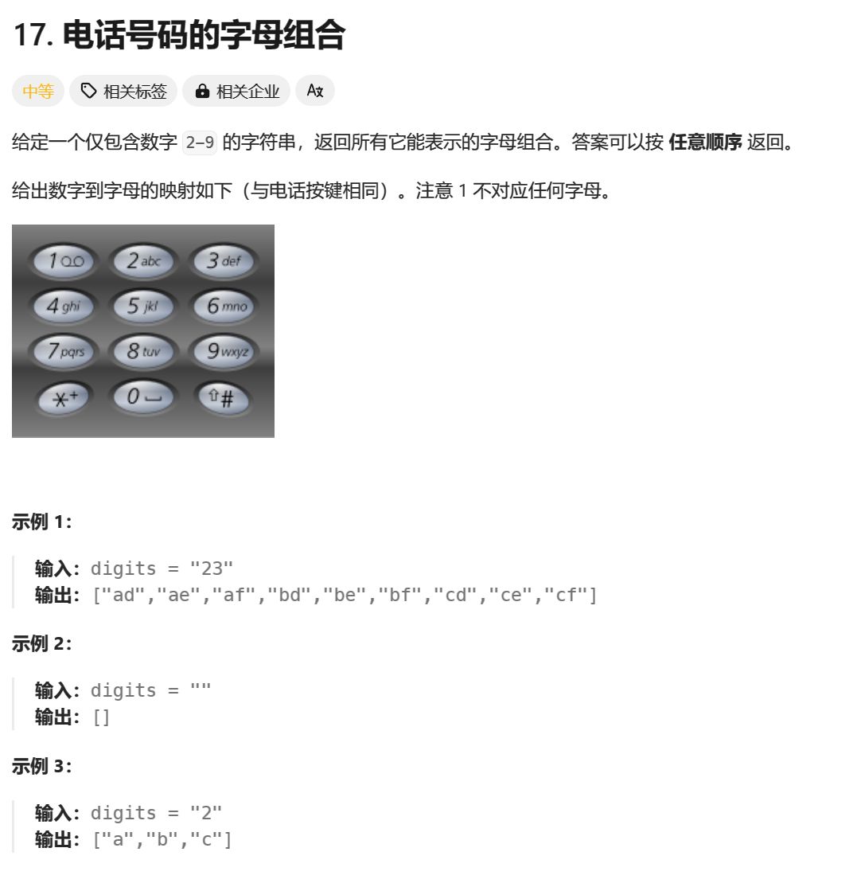
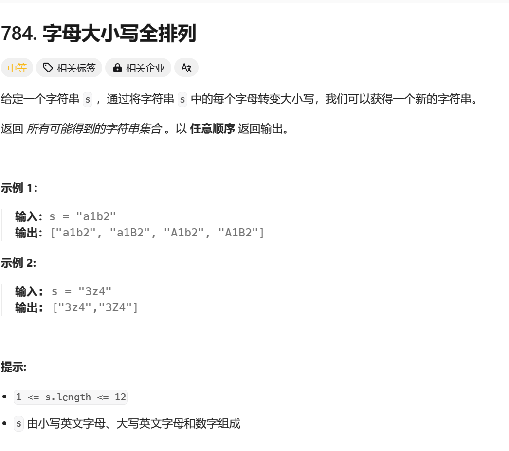
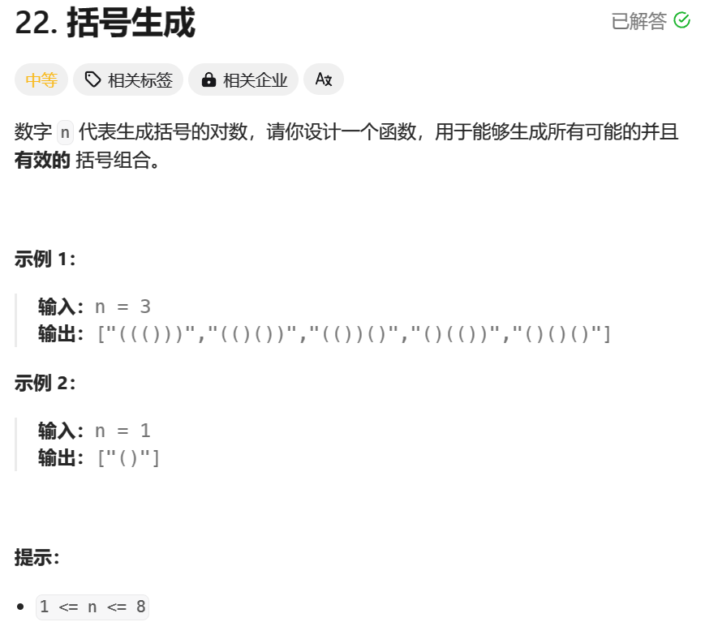
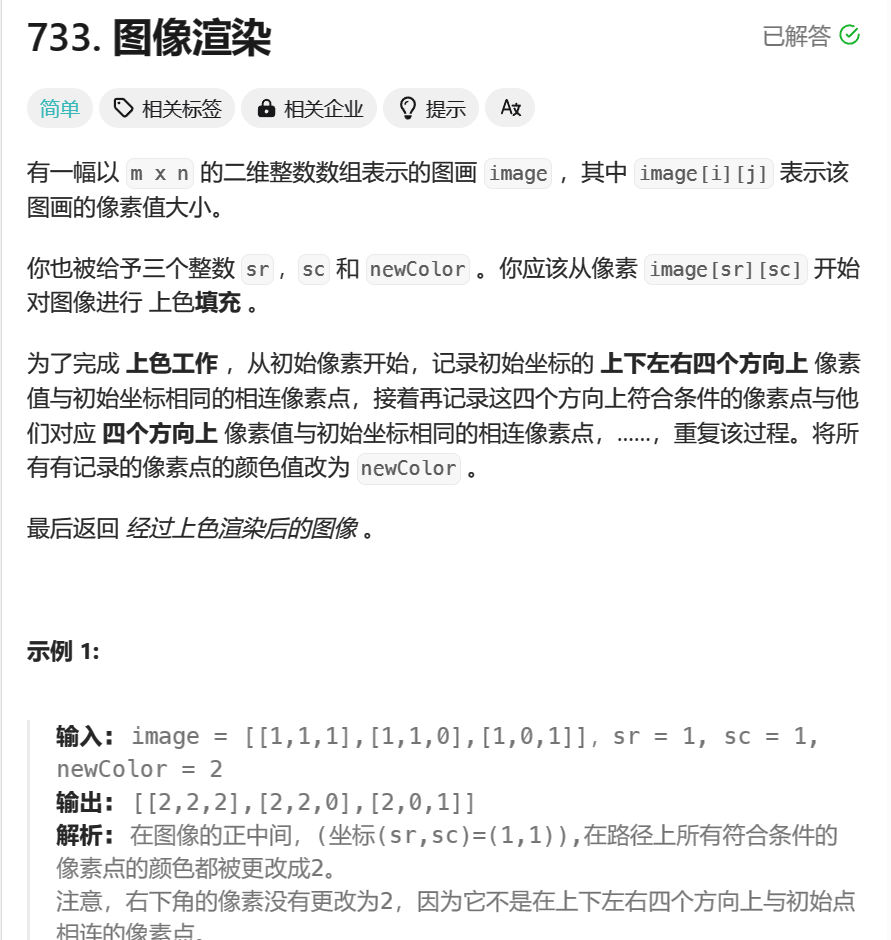
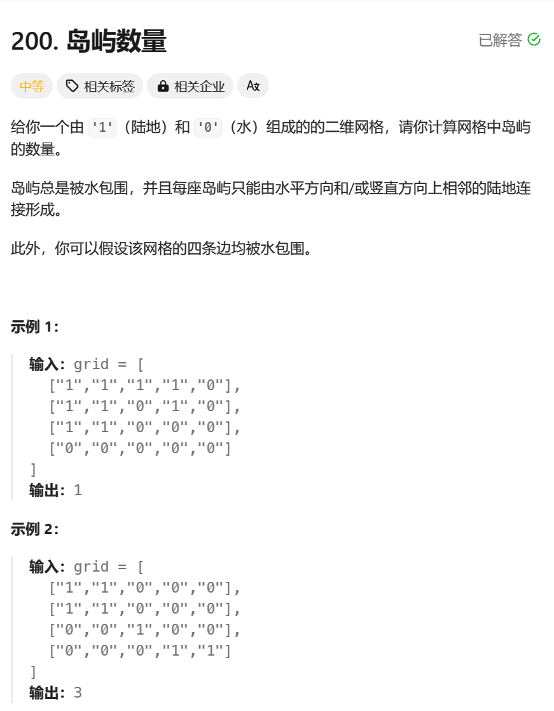
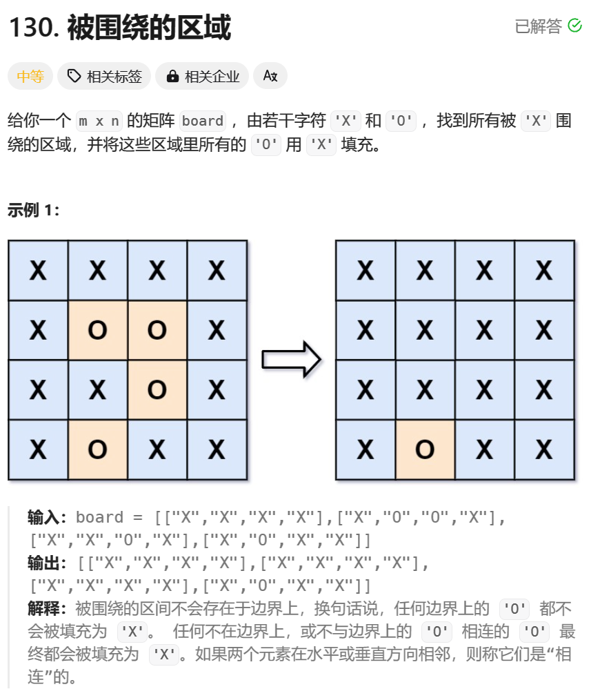
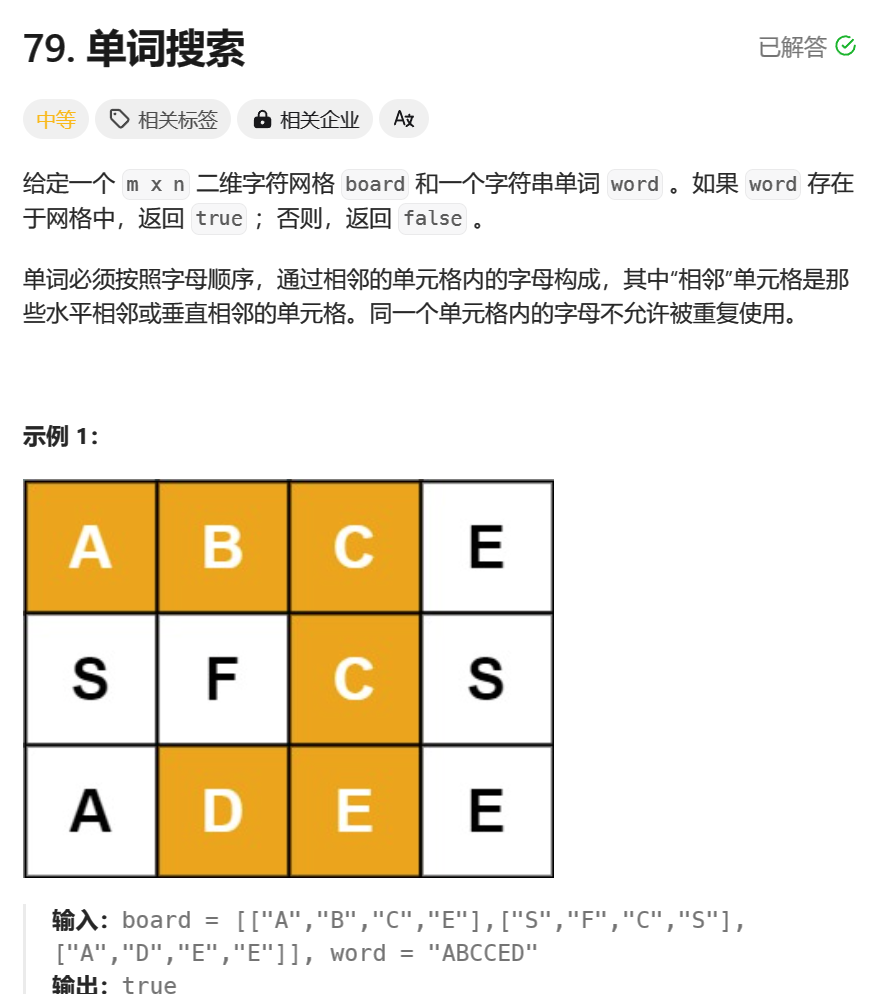

> 回溯算法初探————flood fill、字符串


## 整体解题步骤
回溯算法有统一的代码解方案
1. 确定题解`res`格式和部分可能解`temp`格式

```java
// res
List<List<Integer>> res = new ArrayList<>();
// temp
Deque<Integer> path = new ArrayDeque<>(len);
```
2. 确定递归调用方法

```java
backTrack(nums, res, temp, 0, length, unused);
```
3. 指定递归终止条件

```java
        if (depth == len) {
            res.add(new ArrayList<>(path));
            return;
        }
```
4. 确定回溯位置

```java
        for (int i = 0; i < len; i++) {
                path.addLast(nums[i]);
                dfs(nums, len, depth + 1, path, used, res);
                path.removeLast();
            }
        }
```

`往往还涉及到unused数组的使用或者begin变量，以防止重复情况`


#### [17. 电话号码的字母组合（中等）](https://leetcode-cn.com/problems/letter-combinations-of-a-phone-number/)

- 题目介绍




- 解题思路

1. 将电话簿信息填入哈希表

```java
        HashMap<Character, String> map = new HashMap<>();
        map.put('2', "abc");
        map.put('3', "def");
        map.put('4', "ghi");
        map.put('5', "jkl");
        map.put('6', "mno");
        map.put('7', "pqrs");
        map.put('8', "tuv");
        map.put('9', "wxyz");
```
2. 每个数字对应的字母向后递归回溯

```java
            char c = digits.charAt(index);
            String s = map.get(c);
            for (int i = 0; i < s.length(); i++) {
                stringBuilder.append(s.charAt(i));
                backTrace(digits, map, index + 1, stringBuilder, res);
                stringBuilder.deleteCharAt(index);
            }
```

- 完整代码

```java
class Solution {
    public List<String> letterCombinations(String digits) {
        // 创建一个HashMap用于存储数字与对应的字符组合
        HashMap<Character, String> map = new HashMap<>();
        map.put('2', "abc");
        map.put('3', "def");
        map.put('4', "ghi");
        map.put('5', "jkl");
        map.put('6', "mno");
        map.put('7', "pqrs");
        map.put('8', "tuv");
        map.put('9', "wxyz");

        // 如果输入的字符串长度为0，直接返回一个空的ArrayList
        if (digits.length()==0){
            return new ArrayList<>();
        }

        // 创建一个ArrayList用于存储结果
        ArrayList<String> res = new ArrayList<>();

        // 创建一个StringBuilder用于构建字符组合
        StringBuilder stringBuilder = new StringBuilder();

        // 调用backTrace方法进行回溯计算
        backTrace(digits, map, 0, stringBuilder, res);

        // 返回结果
        return res;
    }

    // 回溯函数，用于生成所有可能的字符组合
    private void backTrace(String digits, HashMap<Character, String> map, int index, StringBuilder stringBuilder, ArrayList<String> res) {
        // 如果字符组合的长度等于输入字符串的长度，说明已经生成了一个完整的字符组合，将其添加到结果列表中
        if (stringBuilder.length() == digits.length()) {
            res.add(stringBuilder.toString());
        } else {
            // 获取当前索引对应的数字字符
            char c = digits.charAt(index);
            // 根据数字字符获取对应的字符组合
            String s = map.get(c);
            // 遍历字符组合中的每个字符
            for (int i = 0; i < s.length(); i++) {
                // 将当前字符添加到字符串构建器中
                stringBuilder.append(s.charAt(i));
                // 递归调用回溯函数，将索引加1，继续生成下一个字符组合
                backTrace(digits, map, index + 1, stringBuilder, res);
                // 回溯，删除刚刚添加的字符，尝试生成其他字符组合
                stringBuilder.deleteCharAt(index);
            }
        }
    }
}
```

#### [784. 字母大小写全排列（中等）](https://leetcode-cn.com/problems/letter-case-permutation/)

- 题目介绍




- 解题思路

1. 确认当前位数的字符是否为字母，分区向后递归回溯

```java
            if (c - 'A' <= 26 && c - 'A' >= 0) {
                for (int i = 0; i < 2; i++) {
                    if (i == 1) {
                        temp.append(c);
                        backTrace(s, res, temp, index+1);
                        temp.deleteCharAt(index);
                    } else {
                        temp.append((char)(c + 32));
                        backTrace(s, res, temp, index+1);
                        temp.deleteCharAt(index);
                    }
                }
```

- 完整代码

```java
class Solution {
    public List<String> letterCasePermutation(String s) {
        // 创建一个StringBuilder用于临时存储字符组合
        StringBuilder temp = new StringBuilder();
        // 创建一个ArrayList用于存储结果
        ArrayList<String> res = new ArrayList<>();
        // 调用backTrace方法进行回溯计算
        backTrace(s, res, temp, 0);
        // 返回结果
        return res;
    }

    // 回溯函数，用于生成所有可能的字符组合
    private void backTrace(String s, ArrayList<String> res, StringBuilder temp, int index) {
        // 如果临时字符组合的长度等于输入字符串的长度，说明已经生成了一个完整的字符组合，将其添加到结果列表中
        if (temp.length() == s.length()) {
            res.add(temp.toString());
        } else {
            // 获取当前索引对应的字符
            char c = s.charAt(index);
            // 判断字符是否为大写字母
            if (c - 'A' <= 26 && c - 'A' >= 0) {
                // 遍历两种情况：保持原字符和转换为小写字母
                for (int i = 0; i < 2; i++) {
                    if (i == 1) {
                        // 保持原字符
                        temp.append(c);
                        // 递归调用回溯函数，将索引加1，继续生成下一个字符组合
                        backTrace(s, res, temp, index+1);
                        // 回溯，删除刚刚添加的字符，尝试生成其他字符组合
                        temp.deleteCharAt(index);
                    } else {
                        // 转换为小写字母
                        temp.append((char)(c + 32));
                        // 递归调用回溯函数，将索引加1，继续生成下一个字符组合
                        backTrace(s, res, temp, index+1);
                        // 回溯，删除刚刚添加的字符，尝试生成其他字符组合
                        temp.deleteCharAt(index);
                    }
                }
            }
            // 判断字符是否为小写字母
            else if (c - 'a' <= 26 && c - 'a' >= 0) {
                // 遍历两种情况：保持原字符和转换为大写字母
                for (int i = 0; i < 2; i++) {
                    if (i == 1) {
                        // 保持原字符
                        temp.append(c);
                        // 递归调用回溯函数，将索引加1，继续生成下一个字符组合
                        backTrace(s, res, temp, index+1);
                        // 回溯，删除刚刚添加的字符，尝试生成其他字符组合
                        temp.deleteCharAt(index);
                    } else {
                        // 转换为大写字母
                        temp.append((char) (c - 32));
                        // 递归调用回溯函数，将索引加1，继续生成下一个字符组合
                        backTrace(s, res, temp, index+1);
                        // 回溯，删除刚刚添加的字符，尝试生成其他字符组合
                        temp.deleteCharAt(index);
                    }
                }
            } else {
                // 如果字符不是字母，则保持原字符
                temp.append(c);
                // 递归调用回溯函数，将索引加1，继续生成下一个字符组合
                backTrace(s, res, temp, index+1);
                // 回溯，删除刚刚添加的字符，尝试生成其他字符组合
                temp.deleteCharAt(index);
            }
        }
    }
}
class Solution {
    public List<String> letterCasePermutation(String s) {
        // 创建一个StringBuilder用于临时存储字符组合
        StringBuilder temp = new StringBuilder();
        // 创建一个ArrayList用于存储结果
        ArrayList<String> res = new ArrayList<>();
        // 调用backTrace方法进行回溯计算
        backTrace(s, res, temp, 0);
        // 返回结果
        return res;
    }

    // 回溯函数，用于生成所有可能的字符组合
    private void backTrace(String s, ArrayList<String> res, StringBuilder temp, int index) {
        // 如果临时字符组合的长度等于输入字符串的长度，说明已经生成了一个完整的字符组合，将其添加到结果列表中
        if (temp.length() == s.length()) {
            res.add(temp.toString());
        } else {
            // 获取当前索引对应的字符
            char c = s.charAt(index);
            // 判断字符是否为大写字母
            if (c - 'A' <= 26 && c - 'A' >= 0) {
                // 遍历两种情况：保持原字符和转换为小写字母
                for (int i = 0; i < 2; i++) {
                    if (i == 1) {
                        // 保持原字符
                        temp.append(c);
                        // 递归调用回溯函数，将索引加1，继续生成下一个字符组合
                        backTrace(s, res, temp, index+1);
                        // 回溯，删除刚刚添加的字符，尝试生成其他字符组合
                        temp.deleteCharAt(index);
                    } else {
                        // 转换为小写字母
                        temp.append((char)(c + 32));
                        // 递归调用回溯函数，将索引加1，继续生成下一个字符组合
                        backTrace(s, res, temp, index+1);
                        // 回溯，删除刚刚添加的字符，尝试生成其他字符组合
                        temp.deleteCharAt(index);
                    }
                }
            }
            // 判断字符是否为小写字母
            else if (c - 'a' <= 26 && c - 'a' >= 0) {
                // 遍历两种情况：保持原字符和转换为大写字母
                for (int i = 0; i < 2; i++) {
                    if (i == 1) {
                        // 保持原字符
                        temp.append(c);
                        // 递归调用回溯函数，将索引加1，继续生成下一个字符组合
                        backTrace(s, res, temp, index+1);
                        // 回溯，删除刚刚添加的字符，尝试生成其他字符组合
                        temp.deleteCharAt(index);
                    } else {
                        // 转换为大写字母
                        temp.append((char) (c - 32));
                        // 递归调用回溯函数，将索引加1，继续生成下一个字符组合
                        backTrace(s, res, temp, index+1);
                        // 回溯，删除刚刚添加的字符，尝试生成其他字符组合
                        temp.deleteCharAt(index);
                    }
                }
            } else {
                // 如果字符不是字母，则保持原字符
                temp.append(c);
                // 递归调用回溯函数，将索引加1，继续生成下一个字符组合
                backTrace(s, res, temp, index+1);
                // 回溯，删除刚刚添加的字符，尝试生成其他字符组合
                temp.deleteCharAt(index);
            }
        }
    }
}
```

#### [22. 括号生成（中等）](https://leetcode-cn.com/problems/generate-parentheses/)

- 题目介绍




- 解题思路

1. 该题结果就两种字符类型，且左括号和右括号数相等，考虑分区

```java
        backTrace(res, temp, n, n);
```

2. 左括号在前，所有让左括号先作递归回溯

```java
        if (left > 0) {
            temp.append("(");
            backTrace(res, temp, left - 1, right);
            temp.deleteCharAt(temp.length() - 1);
        }

        if (right > 0) {
            temp.append(")");
            backTrace(res, temp, left, right - 1);
            temp.deleteCharAt(temp.length() - 1);
        }
```

3. 当右括号数大于左括号时进行剪枝，防止右括号在左括号前面（`不匹配`）的情况
```
        if (left>right){
            return;
        }
```

- 完整代码

```java
class Solution {
    public List<String> generateParenthesis(int n) {
        // 创建一个ArrayList用于存储结果
        ArrayList<String> res = new ArrayList<>();
        // 创建一个StringBuilder用于临时存储括号组合
        StringBuilder temp = new StringBuilder();

        // 调用backTrace方法进行回溯计算

        // 返回结果
        return res;
    }

    // 回溯函数，用于生成有效的括号组合
    private void backTrace(ArrayList<String> res, StringBuilder temp, int left, int right) {
        // 如果左括号和右括号都用完了，说明已经生成了一个有效的括号组合，将其添加到结果列表中
        if (left == 0 && right == 0) {
            res.add(temp.toString());
        }

        // 如果左括号的数量大于右括号的数量，说明生成的括号组合是无效的，直接返回
        if (left > right) {
            return;
        }

        // 如果还有剩余的左括号，可以添加一个左括号
        if (left > 0) {
            temp.append("(");
            // 递归调用回溯函数，将左括号的数量减1，继续生成下一个括号组合
            backTrace(res, temp, left - 1, right);
            // 回溯，删除刚刚添加的左括号，尝试生成其他括号组合
            temp.deleteCharAt(temp.length() - 1);
        }

        // 如果还有剩余的右括号，可以添加一个右括号
        if (right > 0) {
            temp.append(")");
            // 递归调用回溯函数，将右括号的数量减1，继续生成下一个括号组合
            backTrace(res, temp, left, right - 1);
            // 回溯，删除刚刚添加的右括号，尝试生成其他括号组合
            temp.deleteCharAt(temp.length() - 1);
        }
    }
}
```

####  [733. 图像渲染（Flood Fill，中等）](https://leetcode-cn.com/problems/flood-fill/)

- 题目介绍




- 解题思路

1. 设立四个方向的跳跃数组，向四周递归回溯

```java
    int[] dx = {0, 0, 1, -1};
    int[] dy = {1, -1, 0, 0};


        if (image[sr][sc] != preColor) {
            return;
        }
        image[sr][sc] = color;
        for (int i = 0; i < 4; i++) {
            int newSr = sr + dx[i];
            int newSc = sc + dy[i];
            dfs(image, newSr, newSc, color, preColor);
        }
```

- 完整代码

```java
class Solution {
    // 定义水平方向的增量数组
    int[] dx = {0, 0, 1, -1};
    // 定义垂直方向的增量数组
    int[] dy = {1, -1, 0, 0};

    public int[][] floodFill(int[][] image, int sr, int sc, int color) {
        // 获取起始点的颜色
        int preColor = image[sr][sc];
        // 如果起始点的颜色已经是目标颜色，直接返回图像
        if (preColor == color) {
            return image;
        }
        // 调用dfs方法进行深度优先搜索
        dfs(image, sr, sc, color, preColor);
        // 返回修改后的图像
        return image;
    }

    // 深度优先搜索函数
    private void dfs(int[][] image, int sr, int sc, int color, int preColor) {
        // 判断当前点是否越界
        if (sr >= image.length || sr < 0 || sc >= image[0].length || sc < 0) {
            return;
        }
        // 判断当前点的颜色是否与起始点的颜色相同
        if (image[sr][sc] != preColor) {
            return;
        }
        // 修改当前点的颜色为目标颜色
        image[sr][sc] = color;
        // 遍历四个方向，进行递归搜索
        for (int i = 0; i < 4; i++) {
            int newSr = sr + dx[i];
            int newSc = sc + dy[i];
            dfs(image, newSr, newSc, color, preColor);
        }
    }
}
```

####  [200. 岛屿数量（中等）](https://leetcode-cn.com/problems/number-of-islands/)

- 题目介绍




- 解题思路


1.每找到一块陆地边界，则进行递归回溯操作

```java
        for (int i = 0; i < grid.length; i++) {
            for (int j = 0; j < grid[0].length; j++) {
                if (grid[i][j] == '1') {
                    dfs(grid, i, j);
                    count++;
                }
            }
        }
```

- 完整代码

```java
class Solution {
    // 定义水平方向的增量数组
    int[] dx = {1, -1, 0, 0};
    // 定义垂直方向的增量数组
    int[] dy = {0, 0, 1, -1};
    // 定义岛屿数量的计数器
    int count;

    public int numIslands(char[][] grid) {
        // 初始化岛屿数量计数器
        this.count = 0;
        // 遍历整个二维网格
        for (int i = 0; i < grid.length; i++) {
            for (int j = 0; j < grid[0].length; j++) {
                // 如果当前位置是陆地，则进行深度优先搜索
                if (grid[i][j] == '1') {
                    dfs(grid, i, j);
                    // 搜索完成后，岛屿数量加1
                    count++;
                }
            }
        }
        // 返回岛屿数量
        return count;
    }

    // 深度优先搜索函数
    private void dfs(char[][] grid, int i, int j) {
        // 判断当前位置是否越界
        if (i < 0 || j < 0 || i >= grid.length || j >= grid[0].length) {
            return;
        }
        // 如果当前位置是水域，则直接返回
        if (grid[i][j] == '0') {
            return;
        }
        // 将当前位置标记为水域
        grid[i][j] = '0';
        // 遍历四个方向，进行递归搜索
        for (int k = 0; k < 4; k++) {
            int sx = dx[k] + i;
            int sy = dy[k] + j;
            dfs(grid, sx, sy);
        }
    }
}
```

####   [130. 被围绕的区域（中等）](https://leetcode-cn.com/problems/surrounded-regions/)

- 题目介绍




- 解题思路

1.对原来的数组进行拷贝，遍历拷贝数组的边界点找值进行递归回溯
```java
        char[][] copyOf=new char[board.length][board[0].length];
        for (int i = 0; i < board.length; i++) {
            for (int j = 0; j < board[0].length; j++) {
                copyOf[i][j]=board[i][j];
            }
        }
        for (int i = 0; i < board.length; i++) {
            dfs(copyOf, i, 0);
            dfs(copyOf, i, board[0].length - 1);
        }
        for (int i = 0; i < board[0].length; i++) {
            dfs(copyOf, 0, i);
            dfs(copyOf, board.length - 1, i);
        }
```
2. 此时拷贝数组中剩余的点则为答案值，对原数组进行赋值操作

```java
        for (int i = 0; i < board.length; i++) {
            for (int j = 0; j < board[0].length; j++) {
                if (copyOf[i][j]=='O'){
                    board[i][j]='X';
                }
            }
        }
```

- 完整代码

```java
class Solution {
    // 定义水平方向的增量数组
    int[] dx = {1, -1, 0, 0};
    // 定义垂直方向的增量数组
    int[] dy = {0, 0, 1, -1};

    public void solve(char[][] board) {
        // 创建一个与原始二维数组相同大小的副本数组
        char[][] copyOf = new char[board.length][board[0].length];
        // 将原始数组的值复制到副本数组中
        for (int i = 0; i < board.length; i++) {
            for (int j = 0; j < board[0].length; j++) {
                copyOf[i][j] = board[i][j];
            }
        }
        // 遍历副本数组的边界，对边界上的 'O' 进行深度优先搜索
        for (int i = 0; i < board.length; i++) {
            dfs(copyOf, i, 0);
            dfs(copyOf, i, board[0].length - 1);
        }
        for (int i = 0; i < board[0].length; i++) {
            dfs(copyOf, 0, i);
            dfs(copyOf, board.length - 1, i);
        }
        // 遍历原始数组，将副本数组中的 'O' 修改为 'X'
        for (int i = 0; i < board.length; i++) {
            for (int j = 0; j < board[0].length; j++) {
                if (copyOf[i][j] == 'O') {
                    board[i][j] = 'X';
                }
            }
        }
    }

    // 深度优先搜索函数
    private void dfs(char[][] board, int i, int j) {
        // 判断当前位置是否越界
        if (i < 0 || j < 0 || i >= board.length || j >= board[0].length) {
            return;
        }
        // 如果当前位置为 'X'，则直接返回
        if (board[i][j] == 'X') {
            return;
        }
        // 修改当前位置为 'X'
        board[i][j] = 'X';
        // 遍历四个方向，进行递归搜索
        for (int k = 0; k < 4; k++) {
            int sx = dx[k] + i;
            int sy = dy[k] + j;
            dfs(board, sx, sy);
        }
    }
}
```

####   [79. 单词搜索（中等）](https://leetcode-cn.com/problems/word-search/)

- 题目介绍




- 解题思路

1. 在二维数组中找目标字符串的起始值，找到后对当前值置零进行递归，回溯时当值改回

```java
        if (chars[index] != board[i][j]) {
            return;
        }
        if (index == length - 1) {
            res = true;
            return;
        }
        index += 1;
        char pre = board[i][j];
        board[i][j] = '0';
        for (int k = 0; k < 4; k++) {
            int newI = dx[k] + i;
            int newJ = dy[k] + j;
            dfs(board, newI, newJ, index, length, chars);
        }
        board[i][j] = pre;
```
- 设置全局bool变量，当找到完整字符串则赋值true

```java
 int[] dx = {1, -1, 0, 0};
    int[] dy = {0, 0, 1, -1};
    boolean res = false;

    public boolean exist(char[][] board, String word) {
        char[] chars = word.toCharArray();
        int length = chars.length;
        for (int i = 0; i < board.length; i++) {
            for (int j = 0; j < board[0].length; j++) {
                if (chars[0] == board[i][j]) {
                    dfs(board, i, j, 0, length, chars);
                }
            }
        }
        return res;
    }
```

- 完整代码

```java
class Solution {

    // 定义水平方向的增量数组
    int[] dx = {1, -1, 0, 0};
    // 定义垂直方向的增量数组
    int[] dy = {0, 0, 1, -1};
    // 定义结果变量
    boolean res = false;

    public boolean exist(char[][] board, String word) {
        // 将目标字符串转换为字符数组
        char[] chars = word.toCharArray();
        // 获取字符数组的长度
        int length = chars.length;
        // 遍历二维数组
        for (int i = 0; i < board.length; i++) {
            for (int j = 0; j < board[0].length; j++) {
                // 如果第一个字符匹配，开始深度优先搜索
                if (chars[0] == board[i][j]) {
                    dfs(board, i, j, 0, length, chars);
                }
            }
        }
        // 返回结果
        return res;
    }

    private void dfs(char[][] board,
                     int i,
                     int j,
                     int index,
                     int length,
                     char[] chars) {
        // 判断当前位置是否越界
        if (i < 0 || j < 0 || i >= board.length || j >= board[0].length) {
            return;
        }
        // 判断当前位置的字符是否匹配
        if (chars[index] != board[i][j]) {
            return;
        }
        // 如果已经匹配到目标字符串的最后一个字符，设置结果为 true，返回
        if (index == length - 1) {
            res = true;
            return;
        }
        // 增加索引，保存当前位置的字符，将当前位置标记为已访问
        index += 1;
        char pre = board[i][j];
        board[i][j] = '0';
        // 遍历四个方向，进行递归搜索
        for (int k = 0; k < 4; k++) {
            int newI = dx[k] + i;
            int newJ = dy[k] + j;
            dfs(board, newI, newJ, index, length, chars);
        }
        // 将当前位置的字符恢复为之前的值
        board[i][j] = pre;
    }
}
```
