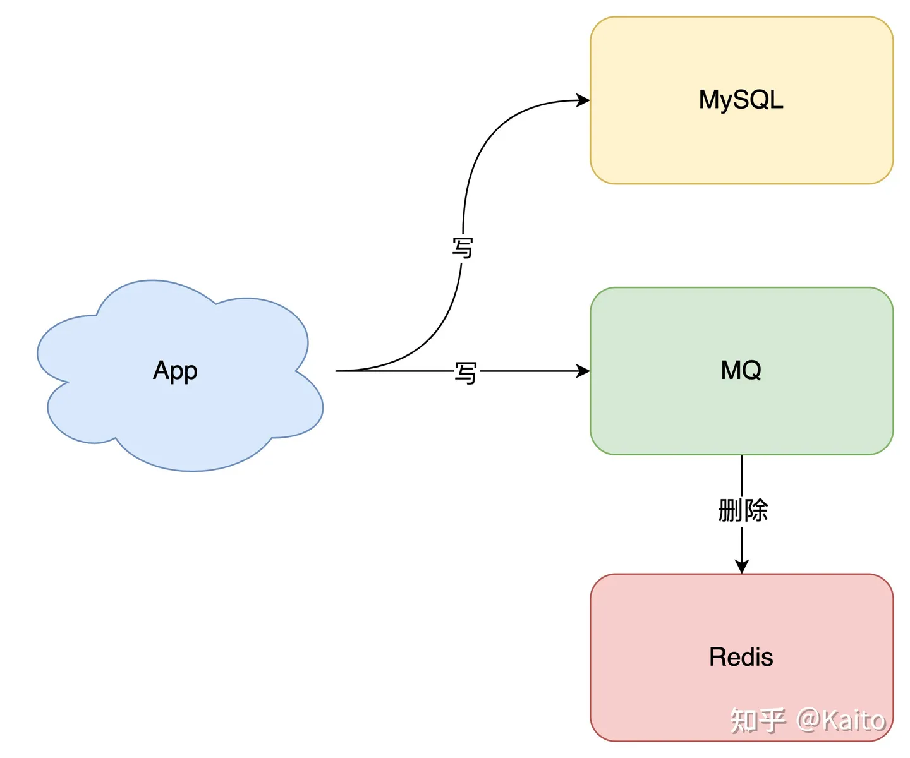
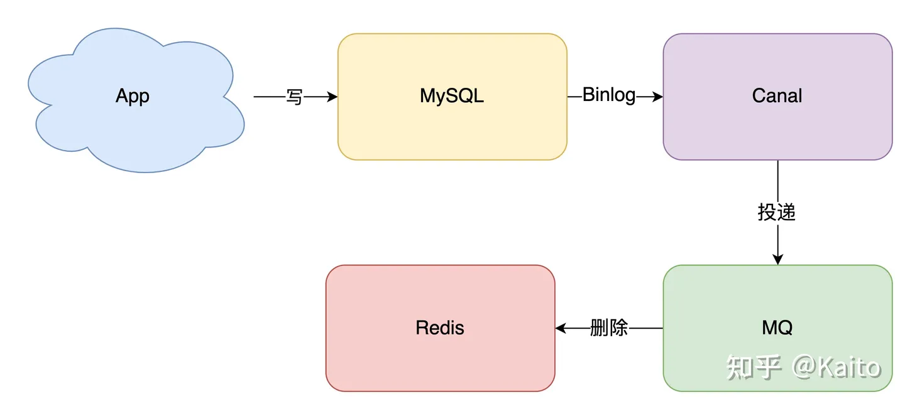
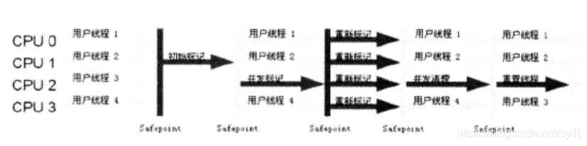
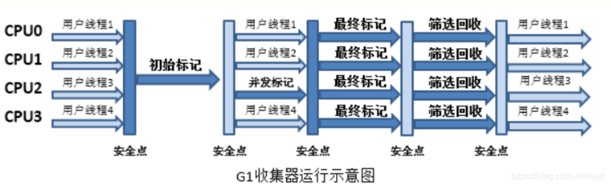
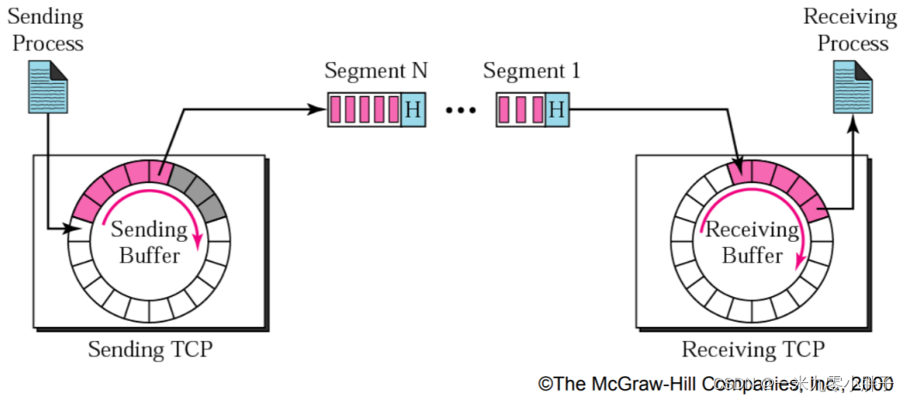
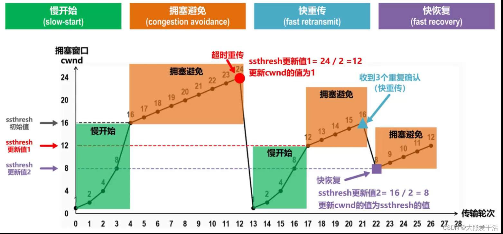

#### sql优化

#### 最左前缀原则

#### 为什么最左前缀原则可以优化sql（索引扫描）

#### 索引失效的场景

#### 如何保证缓存和数据库的一致性

##### 缓存和数据库的操作均会成功的前提

- 先更新数据库，后删除缓存

依旧是 2 个线程并发「读写」数据：

1. 缓存中 X 不存在（数据库 X = 1）
2. 线程 A 读取数据库，得到旧值（X = 1）
3. 线程 B 更新数据库（X = 2)
4. 线程 B 删除缓存
5. 线程 A 将旧值写入缓存（X = 1）
6. 最终 X 的值在缓存中是 1（旧值），在数据库中是 2（新值），也发生不一致。

这种情况「理论」来说是可能发生的，但实际真的有可能发生吗？

其实概率「很低」，这是因为它必须满足 3 个条件：

1. 缓存刚好已失效
2. 读请求 + 写请求并发
3. 更新数据库 + 删除缓存的时间（步骤 3-4），要比读数据库 + 写缓存时间短（步骤 2 和 5）
4. 仔细想一下，条件 3 发生的概率其实是非常低的。

因为写数据库一般会先「加锁」，所以写数据库，通常是要比读数据库的时间更长的。

这么来看，「先更新数据库 + 再删除缓存」的方案，是可以保证数据一致性的。

所以，我们应该采用这种方案，来操作数据库和缓存。

##### 缓存和数据库的操作均不保证成功

- 无论是更新缓存还是删除缓存，只要第二步发生失败，那么就会导致数据库和缓存不一致。




`想要保证数据库和缓存一致性，推荐采用「先更新数据库，再删除缓存」方案，并配合「消息队列」或「订阅变更日志」的方式来做。`

##### 主从库延迟和延迟双删问题

- 第一个问题，还记得前面讲到的「先删除缓存，再更新数据库」导致不一致的场景么？

这里我再把例子拿过来让你复习一下：

2 个线程要并发「读写」数据，可能会发生以下场景：

线程 A 要更新 X = 2（原值 X = 1）
线程 A 先删除缓存
线程 B 读缓存，发现不存在，从数据库中读取到旧值（X = 1）
线程 A 将新值写入数据库（X = 2）
线程 B 将旧值写入缓存（X = 1）
最终 X 的值在缓存中是 1（旧值），在数据库中是 2（新值），发生不一致。

- 第二个问题：是关于「读写分离 + 主从复制延迟」情况下，缓存和数据库一致性的问题。

如果使用「先更新数据库，再删除缓存」方案，其实也发生不一致：

线程 A 更新主库 X = 2（原值 X = 1）
线程 A 删除缓存
线程 B 查询缓存，没有命中，查询「从库」得到旧值（从库 X = 1）
从库「同步」完成（主从库 X = 2）
线程 B 将「旧值」写入缓存（X = 1）
最终 X 的值在缓存中是 1（旧值），在主从库中是 2（新值），也发生不一致。

看到了么？这 2 个问题的核心在于：缓存都被回种了「旧值」。

那怎么解决这类问题呢？

最有效的办法就是，把缓存删掉。

但是，不能立即删，而是需要「延迟删」，这就是业界给出的方案：缓存延迟双删策略。

按照延时双删策略，这 2 个问题的解决方案是这样的：

- 解决第一个问题：在线程 A 删除缓存、更新完数据库之后，先「休眠一会」，再「删除」一次缓存。

- 解决第二个问题：线程 A 可以生成一条「延时消息」，写到消息队列中，消费者延时「删除」缓存。

这两个方案的目的，都是为了把缓存清掉，这样一来，下次就可以从数据库读取到最新值，写入缓存。

`写在最后`：想让缓存和数据库「强一致」很难，缓存是用来提升性能的，多用来保证CAP中的AP，而数据库是用来保证CAP中的CP的，所以，我们应该根据业务场景，来选择使用缓存还是数据库。
做到「强一致」还是得用悲观锁方案。

#### 读写分离、主从集群做性能优化

#### 水平分表、垂直分表要怎么分

#### 扑克牌缺一张，迅速找到缺的是哪张（每个牌编号相加，实际值相减得到丢失的）

#### 实际项目中的sql优化

#### 是否做过性能测试

#### Mysql怎么实现可重复读（MVCC undo log版本链）

#### mysql怎么解决幻读

- 针对快照读（普通 select 语句），是通过 MVCC
  方式解决了幻读，因为可重复读隔离级别下，事务执行过程中看到的数据，一直跟这个事务启动时看到的数据是一致的，即使中途有其他事务插入了一条数据，是查询不出来这条数据的，所以就很好了避免幻读问题。
- 针对当前读（select ... for update 等语句），是通过 next-key lock（记录锁+间隙锁）方式解决了幻读，因为当执行 select ... for
  update 语句的时候，会加上 next-key lock，如果有其他事务在 `next-key lock 锁范围内(一般是当前sql查询的范围)`
  插入了一条记录，那么这个插入语句就会被阻塞，无法成功插入，所以就很好了避免幻读问题。

#### 是否了解过间隙锁

#### jdk17和jdk8的区别

1. Lambda表达式
2. 新增的库
    ```java
    // JDK8
    // 没有Java Flight Recorder库
    // 没有ZGC垃圾回收器
    
    // JDK17
    // 使用Java Flight Recorder记录CPU时间
    JFR.enable();
    // 使用ZGC垃圾回收器
    System.setProperty("jdk.garbageCollector", "Z");
    ```
3. 新的集合操作API
    ```java
    // JDK8
    List<Integer> list = Arrays.asList(1, 2, 3, 4, 5);
    int sum = list.stream().filter(n -> n % 2 == 0).mapToInt(Integer::intValue).sum();
    
    // JDK17
    List<Integer> list = Arrays.asList(1, 2, 3, 4, 5);
    List<Integer> evenList = list.stream().filter(n -> n % 2 == 0).toList();
    Set<Integer> oddSet = list.stream().filter(n -> n % 2 != 0).toSet();
    
    ```
4. 改进的Switch语句
    ```java
    // JDK8
    String dayOfWeek = "MON";
    switch (dayOfWeek) {
        case "MON":
        case "TUE":
        case "WED":
        case "THU":
        case "FRI":
            System.out.println("Weekday");
            break;
        case "SAT":
        case "SUN":
            System.out.println("Weekend");
            break;
        default:
            System.out.println("Invalid day");
    }
    
    // JDK17
    String dayOfWeek = "MON";
    String dayType = switch (dayOfWeek) {
        case "MON", "TUE", "WED", "THU", "FRI" -> "Weekday";
        case "SAT", "SUN" -> "Weekend";
        default -> {
            System.out.println("Invalid day");
            yield "Invalid day";
        }
    };
    
    ```

5. 新的HTTP Client API
    ```java
    // JDK8
    // 使用第三方HTTP库
    
    // JDK17
    HttpClient client = HttpClient.newHttpClient();
    HttpRequest request = HttpRequest.newBuilder()
    .uri(URI.create("https://www.example.com/"))
    .build();
    HttpResponse<String> response = client.send(request, HttpResponse.BodyHandlers.ofString());
        System.out.println(response.body());
    
    ```

#### 说说synchronize（锁升级机制）

1. 偏向锁 (一个线程拿锁，直接给)
2. 轻量级锁 （多个线程拿，用CAS自璇）
3. 重量级锁 （悲观锁）

#### 说说jvm内存模型

#### CMS的阶段（和G1的区别）

##### CMS过程

1. 初始标记：独占PUC，需要STW(Stop the world)，仅标记GCroots能直接关联的对象，速度很快。

2. 并发标记：可以和用户线程并行执行，无需STW，标记所有可达对象

3. 重新标记：独占CPU(STW)，为了修正并发标记期间因用户程序继续运作而导致标记产生变动的那一部分对象的标记记录。这个阶段的停顿时间一般会比初始标记阶段稍长一些，但远比并发标记的时间要短。

4. 并发清理：可以和用户线程并行执行，清理垃圾


##### G1过程

1. 初始标记：独占PUC，需要STW(Stop the world)，仅标记GCroots能直接关联的对象，速度很快。
2. 并发标记：可以和用户线程并行执行，无需STW，标记所有可达对象
3. 最终标记：独占CPU(STW)，为了修正并发标记期间因用户程序继续运作而导致标记产生变动的那一部分对象的标记记录。这个阶段的停顿时间一般会比初始标记阶段稍长一些，但远比并发标记的时间要短。
4. 筛选回收：独占CPU(STW)，根据时间来进行回收，优先回收价值最大的区域


##### G1优势

- 空间整合：
    - 由于G1使用了独立区域（Region）概念，G1从整体来看是基于“标记-整理”算法实现收集，从局部（两个Region）上来看是基于“复制”算法实现的，但无论如何，这两种算法都意味着G1运作期间不会产生内存空间碎片。
    -
    CMS无法处理浮动垃圾：在最后一步并发清理过程中，用户线程执行也会产生垃圾，但是这部分垃圾是在标记之后，所以只有等到下一次gc的时候清理掉，这部分垃圾叫浮动垃圾，因为我边执行清除过程，应用也边产生垃圾。这时需要设置一个百分比来确保程序的可执行，避免CMS运行时，预留的内存无法满足程序的需要。在JDK1.5中，这个百分比为68%，到1.6时，这个参数值提高到了92%。那如果万一有些人说我就要把这个参数值设置100%，那执行的时候内存满了，用户的线程运行不了。这时候会临时启用serial
    Old （单线程执行，会暂停所有用户的线程）收集器来重新进行老年代的垃圾收集，这样停顿时间就更长了。

#### GO相比于java的优势

#### go-zero框架关于缓存穿透的解决方案

#### 四次挥手的过程

#### 最后一次挥手有一个time-wait，为什么

- 确保最后一个确认报文能够到达（如果B没收到A发送来的确认报文，那么就会重新发送连接释放请求报文，A等待一段时间就是为了处理这种情况的发生）
- 避免新旧链接混淆。（等待2MSL可以让本连接持续时间内所产生的所有报文都从网络中消失，使得下一个新的连接请求不会出现旧的连接请求报文）

#### 说一说tcp的滑动窗口

`概念：`

1. 窗口大小指的是无需等待确认应答而可以继续发送数据的最大值。上图的窗口大小就是4000个字节（四个段）。
2. 发送前四个段的时候，不需要等待任何ACK，直接发送；
3. 收到第一个ACK后，滑动窗口向后移动，继续发送第五个段的数据；依次类推；
4. 操作系统内核为了维护这个滑动窗口，需要开辟 发送缓冲区 来记录当前还有哪些数据没有应答；只有确认应答过的数据，才能从缓冲区删掉；
5. 窗口越大，则网络的吞吐率就越高；


##### tcp的流量控制

- 16位窗口大小
  1. 接收端将自己可以接收的缓冲区大小放入 TCP 首部中的 “窗口大小” 字段，通过ACK端通知发送端；
  2. 窗口大小字段越大，说明网络的吞吐量越高；
  3. 接收端一旦发现自己的缓冲区快满了，就会将窗口大小设置成一个更小的值通知给发送端；
  4. 发送端接受到这个窗口之后，就会减慢自己的发送速度；
  5. 如果接收端缓冲区满了，就会将窗口置为0；这时发送方不再发送数据，但是需要定期发送一个窗口探测数据段，使接收端把窗口大小告诉发送端。

#### tcp的拥塞控制算法


1. 最初cwnd=1，ssthresh=16，执行慢开始算法，cwnd大小指数增长
2. cwnd到达慢开始门限ssthresh后，转而执行拥塞避免算法，cwnd线性加一增长
3. 随着发送速率的增加，若发生超时重传，则将慢开始门限ssthresh减小为当前拥塞窗口的一半、再将拥塞窗口cwnd设置为1，然后执行慢开始-–拥塞避免，重复1、2
4. 若发送方收到3个重复确认，则表示分组丢失，发送方立刻重传相应分组；然后执行快恢复算法
5. 将慢开始门限ssthresh和拥塞窗口cwnd重新设置为当前拥塞窗口的一半，然后执行拥塞避免算法

#### 有序数组，原地删除重复的元素最多剩下两个
- 双指针（好难）
``` Java
class Solution {
    public int removeDuplicates(int[] nums) {
        int n = nums.length;
        if (n <= 2) {
            return n;
        }
        int slow = 2, fast = 2;
        while (fast < n) {
            if (nums[slow - 2] != nums[fast]) {
                nums[slow] = nums[fast];
                ++slow;
            }
            ++fast;
        }
        return slow;
    }
}
```

- 计数
```java
class Solution {
    public int removeDuplicates(int[] nums) {
        if (nums.length <= 2) {
            return nums.length;
        }

        int result = 1;
        int times = 1;

        for (int i = 1;i < nums.length;++i) {
            if (nums[i] == nums[i-1]) {
                times++;
                if (times <= 2) {
                    nums[result++] = nums[i];
                }
            } else {
                times=1;
                nums[result++] = nums[i];
            }
        }
        return result;
    }
}
```

#### chatgpt怎么看